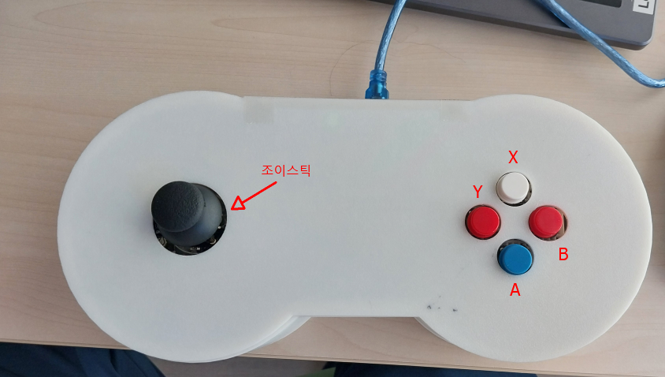
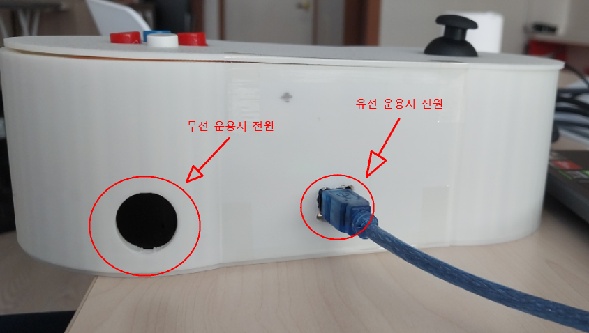
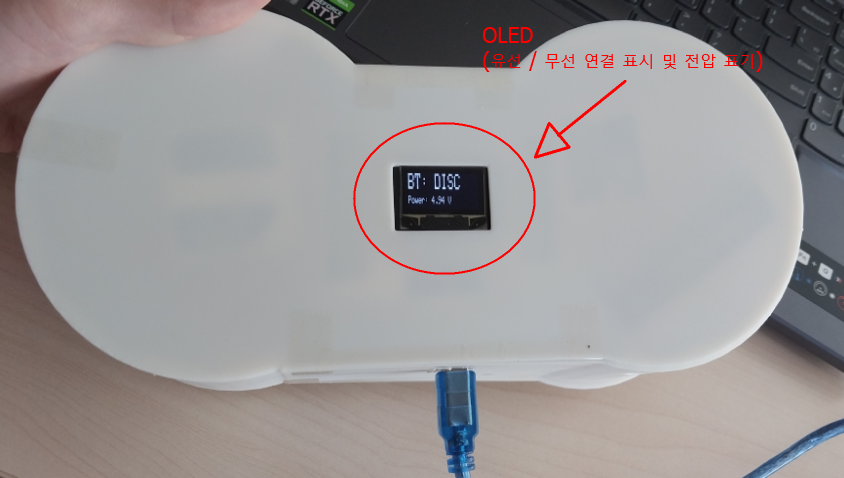
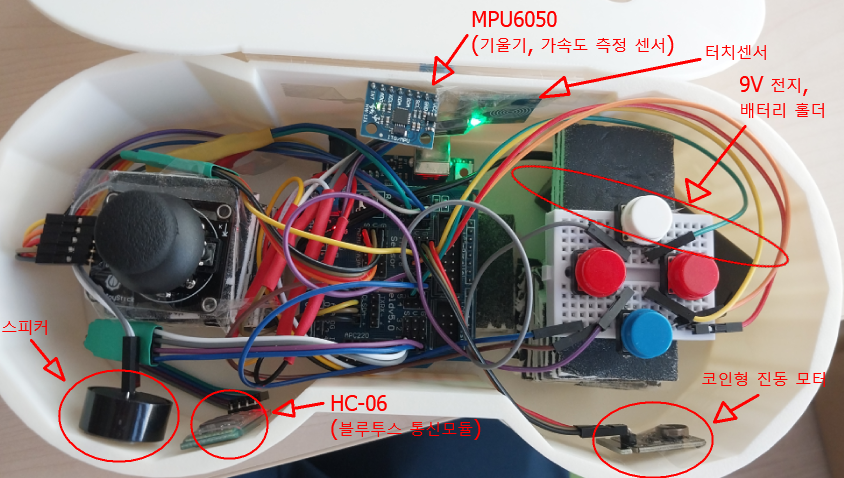
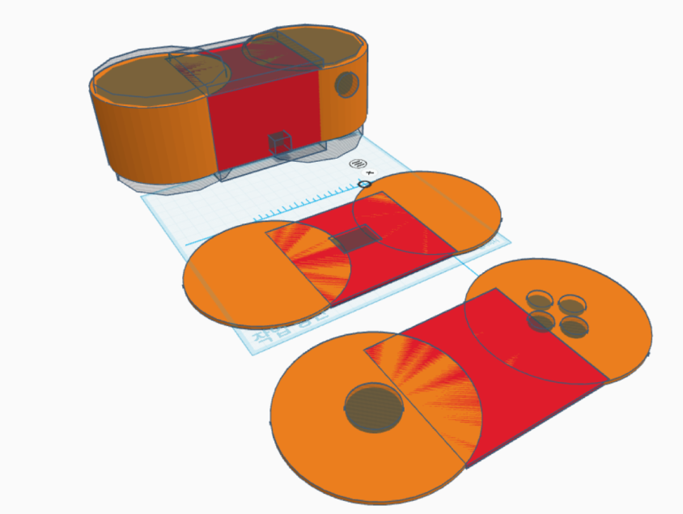

# 1. 개요

> 해당 문서는 2025 2학기 동국대학교 어드벤처 디자인 20분반 A조(일석이조)의 "**Unity를 위한 다용도 컨트롤러 제작 및 전용 개발 패키지 배포**" 프로젝트의 일환으로 작성되었습니다.

## 소개

**안녕하세요! 해당 매뉴얼은 아두이노를 이용해 커스텀 컨트롤러를 만들고, 컨트롤러를 Unity에 적용하는 전반적인 과정을 설명할 것입니다.**

해당 매뉴얼의 최종적인 목표는 저렴하고 입수하기 쉬운 아두이노 부품들의 다양한 기능을 최대한으로 활용하는 커스텀 컨트롤러를 제작하고, Unity에 적용하는 과정을 차례대로 이해하기 쉽게 따라할 수 있도록 설명하는 것이 목표입니다. 매뉴얼을 통해 자신만의 컨트롤러를 만들어 보세요!

## 특징

해당 매뉴얼이 최종적으로 만들 수 있는 컨트롤러의 특징은 다음과 같습니다:

* 조이스틱 수평, 수직 축의 아날로그(0-1023) 성분 송신, On, Off 신호 송신(조이스틱의 눌림)
* X Y A B 버튼의 On, Off 신호 송신
* OLED로 컨트롤러 정보 표시 (유선, 무선 연결 여부 / 전압 표시)
* 무선 연결, 유선 연결 지원(USB-B 연결) (선택 가능)
* MPU6050(IMU)를 이용한 가속도, 기울기 값 송신
* 터치 센서를 이용한 On, Off 신호 송신
* PC로부터 신호를 수신해 스피커와 진동 모터를 통해 소리 / 진동 출력
* 컨트롤러 외관을 위한 3D 모델 파일 제공
  [다운로드 링크](https://drive.google.com/file/d/1lDzlwo81Nyhf5a6_T-KdolwBjIKco2F9/view?usp=sharing)

가장 중요한 점은, 저희가 예시로 첨부한 컨트롤러는 **모든 기능을 다 담은 예시일 뿐**입니다. 특정 기능만 사용한 컨트롤러를 만들고 싶다면 직접 외관을 바꾸고, 필요한 기능만 연결하여 이에 맞는 코드를 아두이노에 업로드해야 합니다. **그러나 어렵지 않습니다!** 컨트롤러를 만드는 과정을 전체적으로 이해한다면 원하는 기능만 넣는 것은 매우 쉽습니다. 왜냐하면 해당 매뉴얼은 **기능별로 연결 방법을 서술**하고, **기능에 따른 코드 역시 모두 함수 형식으로 분류**해 놓았기 때문입니다. 또한 외관은 Tinkercad의 사용법을 조금만 안다면, 복잡하지 않은 형태에 한하여 굉장히 간단하게 만들어 3D 프린터로 출력할 수 있습니다.

### 컨트롤러 완성본 사진(예시)

(예시 3D 모델 파일 [다운로드 링크](https://drive.google.com/file/d/1lDzlwo81Nyhf5a6_T-KdolwBjIKco2F9/view?usp=sharing))
