# 2. 컨트롤러 제작 준비

## 하드웨어 부품

| 부품명                                 |                   사진                   | 구매 정보                                                                                                                                                                                                                                                                                                                                                                                                                                                                                                                    |
| :------------------------------------- | :---------------------------------------: | :--------------------------------------------------------------------------------------------------------------------------------------------------------------------------------------------------------------------------------------------------------------------------------------------------------------------------------------------------------------------------------------------------------------------------------------------------------------------------------------------------------------------------- |
| 아두이노 우노 R3 (또는 호환 보드) |     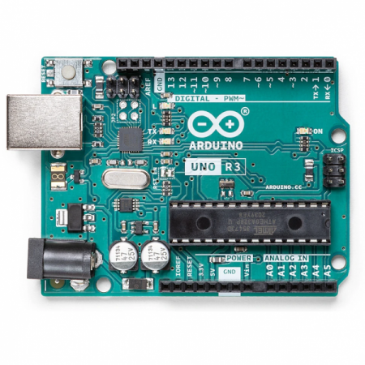     | [구매 링크 바로가기](https://www.devicemart.co.kr/goods/view?no=34404&srsltid=AfmBOorr3sgYxjMCJuqGFDyZf6EzUXWQ9pkfpMhK-bX_u-DOwsMpy_Wu)  가장 기본적인 MCU 보드입니다.                                                                                                                                                                                                                                                                                                                                                     |
| 센서 확장 쉴드 V5.0                    |     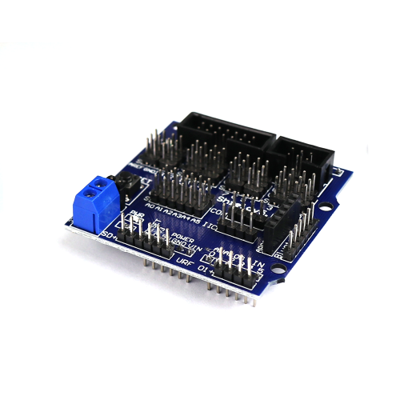     | [구매 링크 바로가기](https://eduino.kr/product/detail.html?product_no=115&cate_no=24&display_group=1)  선 정리에 필수적입니다.                                                                                                                                                                                                                                                                                                                                                                                             |
| HC-06 블루투스 모듈 (무선 통신용) | 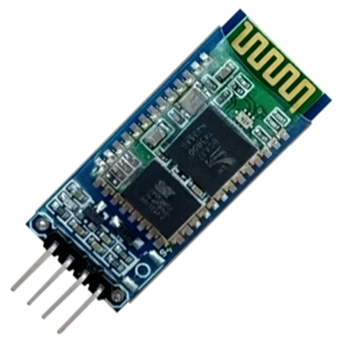 | [구매 링크 바로가기](https://eduino.kr/product/detail.html?product_no=27&cate_no=27&display_group=1)  무선 통신용 모듈입니다.                                                                                                                                                                                                                                                                                                                                                                                              |
| MPU-6050 (기울기 센서)            | 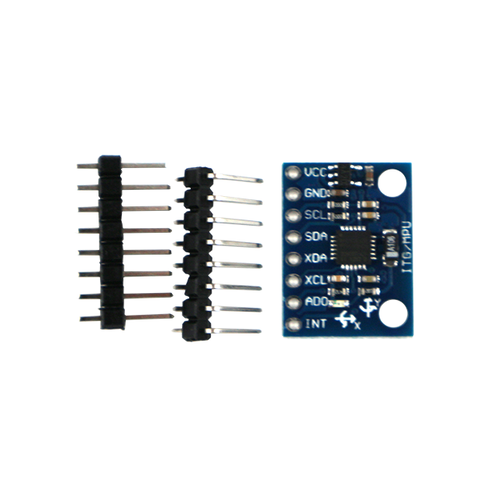 | [구매 링크 바로가기](https://eduino.kr/product/detail.html?product_no=54&cate_no=27&display_group=1) 기울기, 가속도 값을 측정합니다.                                                                                                                                                                                                                                                                                                                                                                                       |
| 조이스틱 모듈                          | 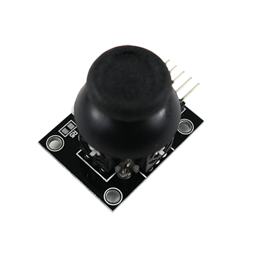 | [구매 링크 바로가기](https://eduino.kr/product/detail.html?product_no=78&cate_no=27&display_group=1)                                                                                                                                                                                                                                                                                                                                                                                                                            |
| 택트 스위치                            | 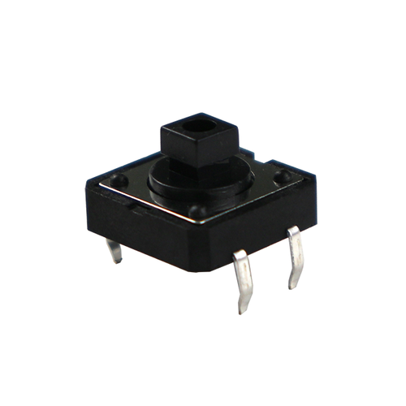 | [구매 링크 바로가기](https://eduino.kr/product/detail.html?product_no=310&cate_no=51&display_group=1)                                                                                                                                                                                                                                                                                                                                                                                                                           |
| 택트 스위치 캡                         | 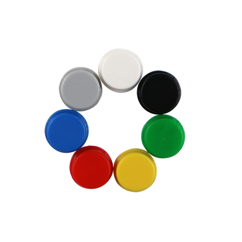 | [구매 링크 바로가기](https://eduino.kr/product/detail.html?product_no=311&cate_no=76)                                                                                                                                                                                                                                                                                                                                                                                                                                           |
| OLED 디스플레이                        | 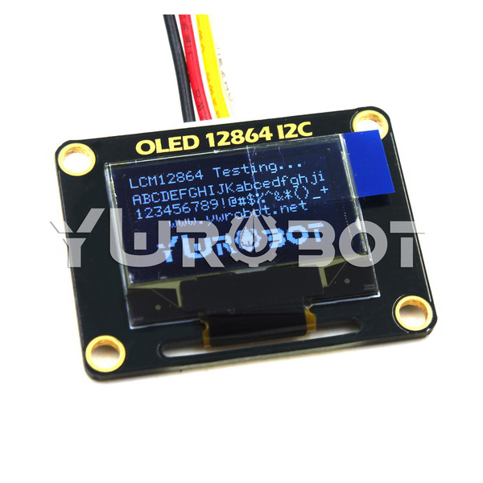 | [구매 링크 바로가기](https://www.devicemart.co.kr/goods/view?no=1311755)                                                                                                                                                                                                                                                                                                                                                                                                                                                        |
| 진동 모터 모듈                         | 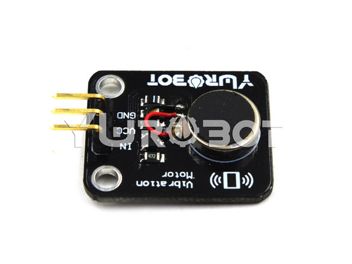 | [구매 링크 바로가기](https://www.devicemart.co.kr/goods/view?no=1312092&market=naver&NaPm=ct%3Dmin77xv4%7Cci%3Df0661fa83dd6671518601e0ac9530cdaceecc6d1%7Ctr%3Dsls%7Csn%3D876973%7Chk%3D91ca6feb1d33acc17054cfb5f89c1a4d18bc98c0)                                                                                                                                                                                                                                                                                               |
| 부저 스피커                            | 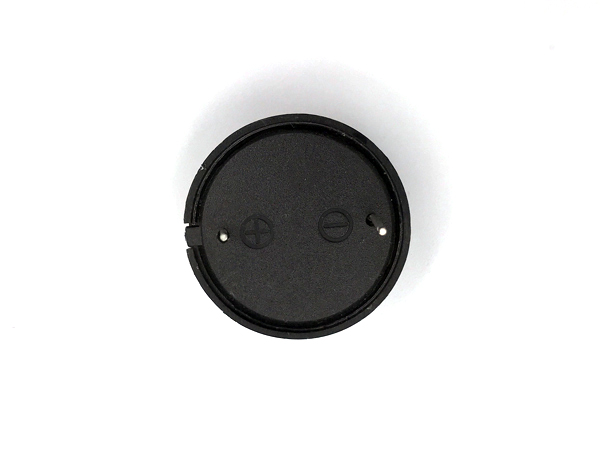 | [구매 링크 바로가기](https://www.devicemart.co.kr/goods/view?no=1361134)                                                                                                                                                                                                                                                                                                                                                                                                                                                        |
| 터치 센서 모듈                         | 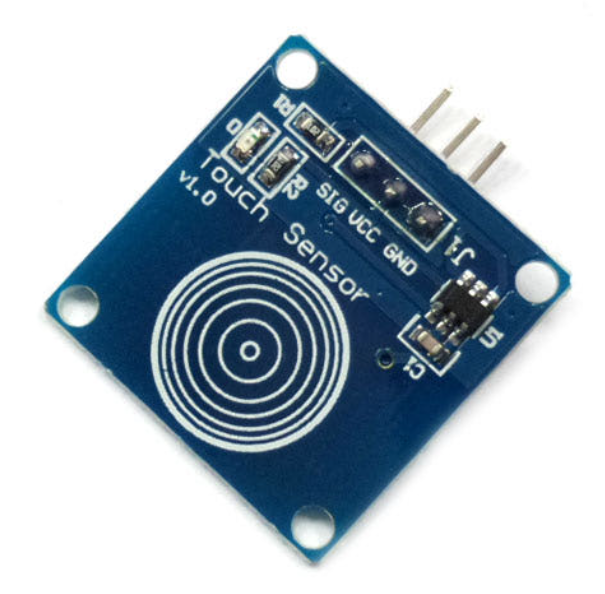 | [구매 링크 바로가기](https://smartstore.naver.com/ds-parts/products/2292761197)                                                                                                                                                                                                                                                                                                                                                                                                                                                 |
| 9V 배터리                              | 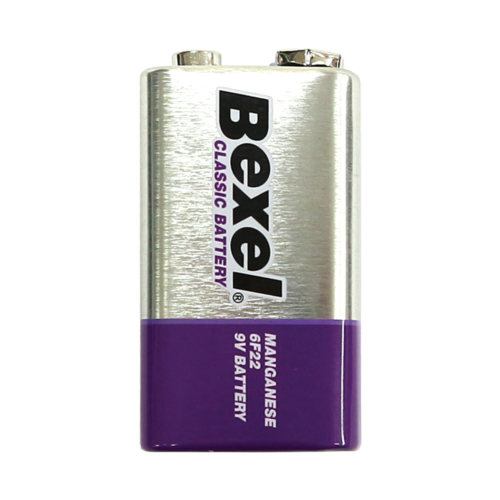 | [구매 링크 바로가기](https://eduino.kr/product/detail.html?product_no=440&cate_no=51&display_group=1)                                                                                                                                                                                                                                                                                                                                                                                                                           |
| 배터리 홀더                            | 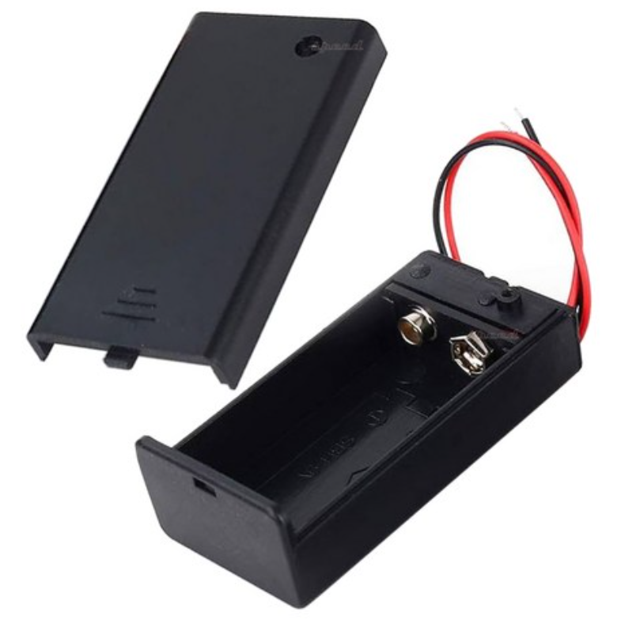 | [구매 링크 바로가기](https://www.coupang.com/vp/products/8376780478?itemId=24204016914&vendorItemId=91221551860&src=1042503&spec=10304025&addtag=400&ctag=8376780478&lptag=8376780478-24204016914&itime=20251201224442&pageType=PRODUCT&pageValue=8376780478&wPcid=17604970437384905999186&wRef=www.google.com&wTime=20251201224442&redirect=landing&gclid=CjwKCAiAlrXJBhBAEiwA-5pgwi9y98JqOjwYo4uWTKxJIc8SWGJQ_8iPa2bW0Fm_FfCzBRq3_ryWnBoC-KcQAvD_BwE&mcid=fc0c706c49714bf5a1662d7a028d13b8&campaignid=22815108882&adgroupid=) |
| 점퍼 케이블 (암-수)                    | 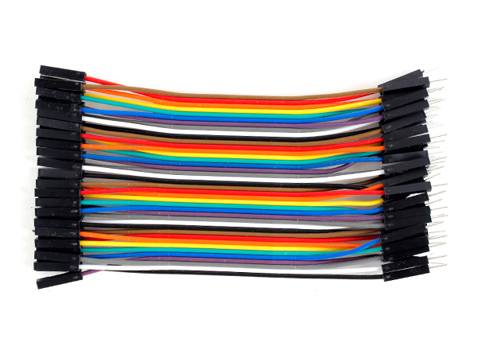 | [구매 링크 바로가기](https://www.devicemart.co.kr/goods/view?no=1328408)                                                                                                                                                                                                                                                                                                                                                                                                                                                        |
| 점퍼 케이블 (암-암)                    | 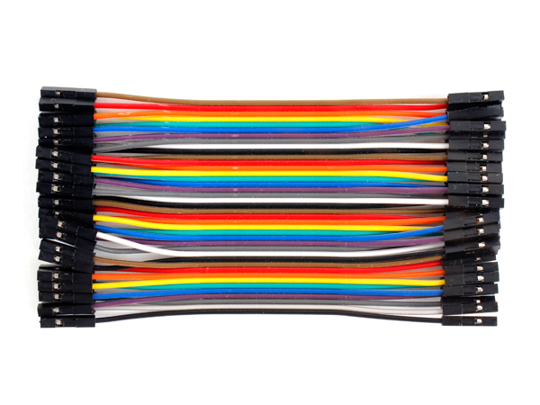 | [구매 링크 바로가기](https://www.devicemart.co.kr/goods/view?no=1328410)                                                                                                                                                                                                                                                                                                                                                                                                                                                        |
| 점퍼 케이블 (수-수)                    | 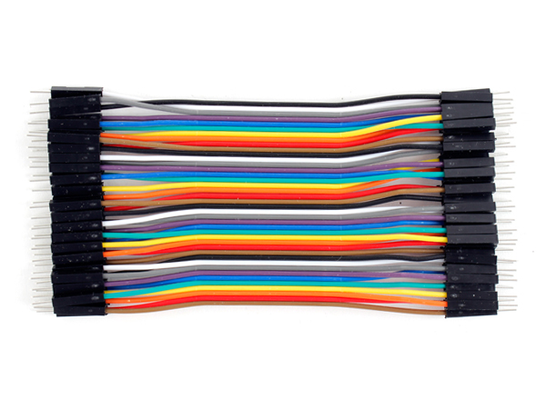 | [구매 링크 바로가기](https://www.devicemart.co.kr/goods/view?no=1328409)                                                                                                                                                                                                                                                                                                                                                                                                                                                        |
| 미니 브레드보드                        | 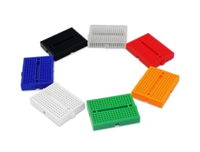 | [구매 링크 바로가기](https://www.devicemart.co.kr/goods/view?no=1329504)                                                                                                                                                                                                                                                                                                                                                                                                                                                        |

이중에서 무조건 필요한 부품은 **아두이노 우노 R3**입니다. 나머지는 **원하는대로** 넣으면 됩니다.
그러나 **개요 문단**에서 보여드린 컨트롤러와 똑같이 만들기 위해서는 해당 부품이 전부 필요합니다.
이외에 있으면 좋은 기타 도구는 다음과 같습니다.

* USB-B 케이블 (PC 연결용)
* 3D 프린터 출력물 (케이스)
* 글루건, 절연 테이프 (고정 및 마감용)
* 니퍼 (선 정리용)
* 가위
* 우드락 (내부 부품 지지에 탁월합니다!)

## 개발 환경 설정

하드웨어를 조립하기 전에, 아두이노와 컴퓨터가 서로 대화할 수 있도록 소프트웨어 환경을 먼저 설정해야 합니다.

### 아두이노 IDE 설치

아두이노 보드에 코드를 업로드하기 위한 필수 프로그램입니다.

1. **다운로드:** [아두이노 공식 홈페이지](https://www.arduino.cc/en/software)에 접속하여 운영체제(Windows, Mac 등)에 맞는 버전을 다운로드합니다.
2. **설치:** 다운로드한 파일을 실행하여 설치를 완료합니다.
3. **실행 확인:** 설치된 `Arduino IDE`를 실행하고 창이 정상적으로 뜨는지 확인합니다.

### 필수 라이브러리 설치

이 프로젝트에서 사용하는 센서와 디스플레이를 작동시키기 위해 전용 라이브러리를 설치해야 합니다.

1. 아두이노 IDE 상단 메뉴에서 `스케치(Sketch)` > `라이브러리 포함하기(Include Library)` > `라이브러리 관리(Manage Libraries...)`를 클릭합니다.
2. 검색창에 아래 라이브러리 이름을 각각 검색하여 **[설치(Install)]** 버튼을 누릅니다.
   * `Adafruit MPU6050` (기울기 센서용)
   * `Adafruit SSD1306` (OLED 디스플레이용)
   * `Adafruit GFX Library` (그래픽 처리용)
   * *(설치 중 'Dependency' 설치를 묻는 창이 뜨면 **Install All**을 클릭하세요.)*

### 드라이버 설치 (호환 보드 사용자)

정품 아두이노가 아닌 호환 보드(SMD 타입 등)를 사용하는 경우, PC가 보드를 인식하지 못할 수 있습니다.

1. 장치 관리자에서 `알 수 없는 장치`가 뜨거나 포트가 잡히지 않는다면 **CH340 드라이버**가 필요합니다.
2. 구글에서 **CH340 Driver**를 검색하여 드라이버를 다운로드 및 설치합니다.
3. 설치 후 PC를 재부팅하고 아두이노를 다시 연결하여 포트가 인식되는지 확인합니다.
