# 3. 하드웨어 제작

하드웨어 제작 설명에 앞서, 모든 부품은 ****센서 확장 쉴드에 꽃는 것****으로 가정하고 설명합니다.

센서 확장 쉴드는 부품을 꽃을 때, 브레드보드에 신호를 병렬로 나누어 처리할 필요가 없습니다.

예를 들어 일반적인 아두이노 보드에서는 D1, D2에 선을 꽃는다고 하면 먼저 각 선을 D1, D2에 꽃고, 그다음 D1, D2를 사용하는 부품이 전원을 공급받을 수 있게 VCC, GND 단자에도 선을 연결해야합니다.

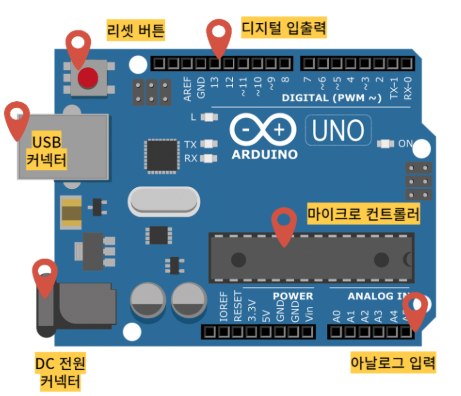

그러나 사진에서 보시다시피 VCC, GND 단자가 매우 적습니다. 만일 전원을 공급하려면 브레드보드를 이용해서 병렬연결을 해야합니다.
꼼수가 있다면, 병렬 연결할 전선 두개의 피복을 벗긴뒤 서로 꼬와서 테이프를 붙이는 방법도 있습니다. 그러나 가장 좋은 방법은 센서 확장 쉴드를 쓰는 것입니다.

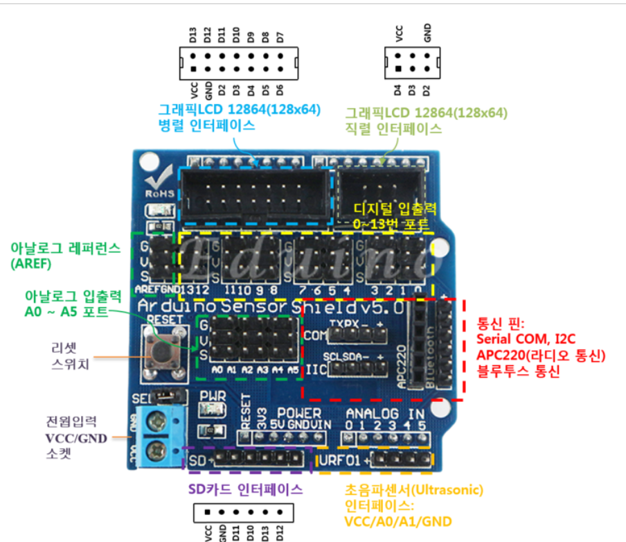

센서 확장 쉴드는 우노 보드 위에 바로 작창할 수 있습니다. 또한 보다시피, 디지털 입출력 포트, 아날로그 입출력 포트는 전원부를 병렬 없이 바로 연결할 수 있도록 돕습니다.
이는 여러 컨트롤러 부품을 장착할 때 매우 유용할 것입니다.

그러나, 만일 부품을 적게 사용한다면, 센서 확장 쉴드를 사용할 이유는 전혀 없습니다!
그런 경우는 아두이노 보드를 바로 사용하여도 큰 문제가 없습니다.

---

해당 문단에서는 부품별로 사용하는 함수, 아두이노 보드와 연결하는 방법에 대해서 설명합니다.
서론 내용을 바탕으로 필요한 부품만 보드에 연결하여 사용하세요.

여담으로, 컨트롤러에 사용할 모든 부품은 저항이 필요 없는 부품을 구입할 수 있도록 리스트를 작성했습니다.
택트 스위치는 유일하게 브레드 보드를 사용해야하는 부품입니다. 그러나 미니 브레드 보드를 사용하면 공간을 획기적으로 절약할 수 있습니다.
또한, 각 부품은 바로 커넥터로 연결할 수 있는 부품으로 골랐습니다.

---

## 서론

### 아두이노 소스코드의 탭 별 이름 및 기능

이 매뉴얼에서 소개하는 컨트롤러는 앞서 4장 설계 목표에서 제시한 모든 기능을 하나로 합쳐서, 기능이 꽉 찬 완전체 컨트롤러 예제를 만드는 것을 목표로 하고 있습니다.

하지만 모든 기능을 다 쓸 필요는 없겠죠? 그래서 나중에 다른 개발자분들이 이 매뉴얼을 보고 "어? 난 이 기능만 필요한데?" 싶을 때 원하는 부품만 쏙쏙 골라서 아두이노 보드에 추가할 수 있도록, 기능별로 범주를 딱 나눠서 설명해 드릴 예정입니다. 아두이노 부품들은 원래 레고처럼 따로따로 나눠져 있어서 원하는 것만 연결하면 되거든요.

그런데 하드웨어는 골라서 연결하면 되지만, 소프트웨어는 조금 다를 수 있습니다. 어떤 부품을 연결하느냐에 따라 코드를 다르게 짜야 할 수도 있으니까요. 그래서 저희는 어떤 기능을 쓰더라도 코드가 꼬이지 않도록 **함수형 프로그래밍 방법론**을 사용해서 코드를 아주 깔끔하게 정리했습니다.

`setup` 함수와 `loop` 함수가 있는 메인 탭에는 복잡한 코드는 다 빼고, 오직 라이브러리 선언이나 변수 선언 같은 필수적인 내용만 남겨뒀습니다. 나머지 구체적인 기능들은 전부 **새로운 탭**을 만들어서 따로따로 정리했죠. 소스 코드의 탭 이름들은 아래 표를 보시면 쉽게 이해하실 수 있을 거예요.

| 탭 이름                           | 기능                                                                              |
| --------------------------------- | --------------------------------------------------------------------------------- |
| **functions_main.ino**      | 라이브러리 선언 및 전역 변수, setup, loop 함수 관리                               |
| **functions_etc.ino**       | 시리얼 설정, 버퍼 데이터 수신, 명령어 실행, 유니티 신호 수신, 전압 계산 함수 관리 |
| **functions_mpu.ino**       | 기울기 센서 설정, 기울기 센서 값 수신 함수 관리                                   |
| **functions_joystick.ino**  | 조이스틱 설정, 조이스틱 값 수신 함수 관리                                         |
| **functions_speaker.ino**   | 스피커 설정, 소리 재생 함수 관리                                                  |
| **functions_button.ino**    | 버튼 설정, 버튼 값 수신 함수 관리                                                 |
| **functions_touch.ino**     | 터치 센서 설정, 터치 센서 값 수신 함수 관리                                       |
| **functions_oled.ino**      | OLED 설정, 화면 내용 출력                                                         |
| **functions_vibration.ino** | 진동 모터 설정, 진동 출력 함수 관리                                               |

`functions_main.ino`와 `functions_etc.ino`를 뺀 나머지 탭들은 5.2장에서 자세하게 다룰 예정입니다. 그리고 원본 소스 코드는 깃허브 링크([https://github.com/seonghoon0905/AVDGroupAProject)에서](https://www.google.com/search?q=https://github.com/seonghoon0905/AVDGroupAProject)에서) 확인하실 수 있으니 참고해 주세요!

---

### functions_main의 구조

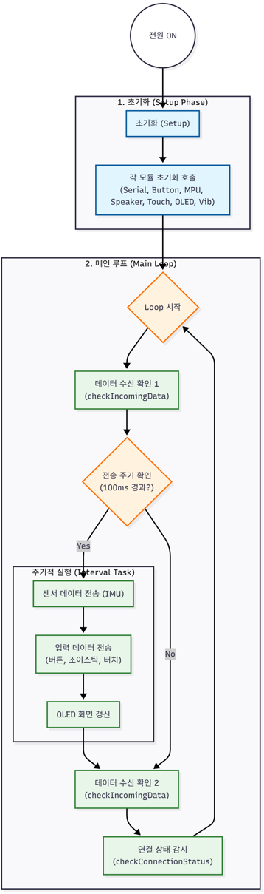

**functions_main.ino의 흐름도**

```c
// [라이브러리 및 전역 변수 선언부 생략]
// ... Adafruit_MPU6050, SSD1306 등 필수 라이브러리 추가 ...
// ... 핀 번호 상수 및 상태 제어용 전역 변수 정의 ...// 수신 중인 문자열 임시 저장소
String inputBuffer = "";bool isUsbMode = false;
bool isBtConnected = false;          // 현재 연결 상태 (true: 연결됨, false: 끊김)
unsigned long lastPingTime = 0;      // 마지막으로 'P' 신호를 받은 시간
const long connectionTimeout = 2000; // 2초(2000ms) 동안 신호 없으면 끊김 처리// OLED 갱신용 타이머 변수 (화면은 천천히 갱신해도 됨)
unsigned long previousOledMillis = 0;
const long oledInterval = 250; // 0.25초마다 화면 갱신 (너무 빠르면 통신 느려짐)// --- 주기 설정 ---
unsigned long previousMillis = 0;
const long interval = 100;void setup() {
  // 1. 각 하드웨어 모듈 초기화 함수 순차 호출
  initButtons();    // 버튼 핀 설정 (INPUT_PULLUP)
  initSerial();     // 시리얼 통신 시작 (모드에 따른 Baudrate 설정)
  initMPU6050();    // IMU 센서 설정
  initSpeaker();    // 스피커 출력 설정
  initTouch();      // 터치 센서 설정
  initOLED();       // 디스플레이 초기화
  initVibration();  // 진동 모터 설정
}void loop() {
  // 1. [최우선] 수신 데이터 상시 확인 (지연 최소화)
  checkIncomingData();  // 2. 데이터 전송 스케줄링 (100ms 주기)
  unsigned long currentMillis = millis();
  if (currentMillis - previousMillis >= interval) {
    previousMillis = currentMillis;    // 각 센서 데이터 전송 함수 호출
    sendSensorData();   // IMU (G ...)
    sendButtonData();   // 버튼 (X, Y, B, A ...)
    sendJoystickData(); // 조이스틱 (J ...)
    sendTouchData();    // 터치 (T ...)    // 3. 디스플레이 갱신 스케줄링 (250ms 주기)
    if (millis() - previousOledMillis >= oledInterval) {
       previousOledMillis = millis();
       updateScreen();
    }
  }  // 4. 연결 상태 모니터링
  checkIncomingData();      // 전송 후 재확인
  checkConnectionStatus();  // 타임아웃 체크
}
```

**functions_main.ino의 구조**

`functions_main.ino` 파일은 전역 변수 선언, 시스템 초기화, 그리고 주기적인 작업 관리를 담당합니다.

* **`isUsbMode`** : 컨트롤러를 유선(USB)으로 쓸 건지 결정하는 변수입니다.
* **`isBtConnected`** : 무선으로 쓸 때 블루투스가 잘 연결되어 있는지 확인하는 변수입니다.
* **`lastPingTime`** : Unity로부터 마지막으로 신호를 받은 시간을 기록해 둡니다.
* **`connectionTimeout`** : 만약 Unity에서 오랫동안 신호가 안 오면 "연결 끊김" 처리를 하기 위한 시간입니다.
* **`inputBuffer`** : Unity에서 보낸 명령어를 잠시 담아두는 문자열 변수입니다.

`loop` 함수 안에서는 `millis()` 함수를 이용해서 **비동기 타이머 방식**을 사용했습니다. 이게 뭐냐면, 센서 데이터 보내는 주기랑 화면 갱신하는 주기를 따로따로 관리해서 아두이노가 더 효율적으로 일하게 만드는 거예요. 이렇게 하면 통신 속도가 훨씬 빨라집니다.

그리고 `setup`이랑 `loop` 함수에 있는 기능별 함수들은 앞서 설명한에 있는 모든 탭들을 다 작성해야 쓸 수 있습니다. 만약 안 쓰는 기능이 있어서 탭을 안 만들었다면, 메인 코드에서도 그 함수는 지워주시면 됩니다. 라이브러리나 전역 변수 정의 같은 자세한 코드는 차후 내용에서 더 설명해 드릴게요.

---

### functions_etc의 구조

```c
/**
 * @name initSerial
 * @brief 부팅 시 버튼 X가 눌려있으면 유선 고속 모드(115200), 아니면 무선 모드(9600)로 시작
 */
void initSerial() {
  if (digitalRead(BUTTON_PIN_X) == LOW) {
    Serial.begin(115200); 
    isUsbMode = true; // ★ USB 모드 활성화
  } 
  else {
    Serial.begin(9600); 
    isUsbMode = false;
  }
}

void checkIncomingData() {
  // 하드웨어 버퍼에 데이터가 쌓여있는 만큼 다 읽어들임
  while (Serial.available() > 0) {
    char c = (char)Serial.read();

    // 1. 종료 문자('\n')가 오면 명령어 완성!
    if (c == '\n') {
      inputBuffer.trim(); // 공백 제거
  
      if (inputBuffer.length() > 0) {
        // 큐에 넣지 않고, 그 자리에서 바로 실행!
        executeCommand(inputBuffer); 
      }
  
      inputBuffer = ""; // 버퍼 비우기
    } 
    // 2. 아니면 글자 이어 붙이기
    else {
      inputBuffer += c;
    }
  }
}

// 명령어 실행 함수 (기존 코드 재사용)
void executeCommand(String cmd) {
  // 하트비트 (P)
  if (cmd == "P") {
    lastPingTime = millis();
    if (!isBtConnected) {
      isBtConnected = true;
      // updateOLED("Connected", ""); 
    }
    return;
  }
  
  // 소리 재생 (S ...)
  if (cmd.startsWith("S")) {
    int soundType = cmd.substring(2).toInt();
    playSoundEffect(soundType); 
  }
  
  // 진동 (V ...)
  if (cmd.startsWith("V")) {
    int vibType = cmd.substring(2).toInt();
    playVibrationEffect(vibType);
  }
}

/**
 * @name checkConnectionStatus
 * @brief 유니티로부터 2초 이상 신호(P)가 없으면 연결 끊김으로 처리
 */
void checkConnectionStatus() {
  if (isBtConnected && (millis() - lastPingTime > connectionTimeout)) {
    isBtConnected = false; 
  }
}

long readVcc() {
  // 1. 내부 기준 전압(1.1V)을 측정하도록 설정 (복잡한 레지스터 조작)
  ADMUX = _BV(REFS0) | _BV(MUX3) | _BV(MUX2) | _BV(MUX1);
  
  delay(2); // 안정화 대기
  ADCSRA |= _BV(ADSC); // 측정 시작!
  while (bit_is_set(ADCSRA,ADSC)); // 측정 끝날 때까지 기다림

  // 2. 측정값 읽기
  uint8_t low  = ADCL; 
  uint8_t high = ADCH;
  long result = (high<<8) | low;

  // 3. 역산 (계산)
  // 1125300 = 1.1V * 1023 * 1000 (상수)
  result = 1125300L / result; 
  
  return result; // 결과: 밀리볼트 (mV) 단위 (예: 4985mV)
}
```

**functions_etc.ino의 구조**

`functions_etc.ino` 탭은 시리얼 통신 초기화, 데이터 수신 및 해석, 명령어 실행, 그리고 시스템 전압 측정 같은 관리 함수들을 모아둔 곳입니다.

첫째, **`initSerial`** 함수입니다.
이건 컨트롤러를 켤 때 특정 버튼을 누르고 있는지 확인해서 통신 모드를 결정해 주는 똑똑한 함수예요. 만약 제어 버튼으로 쓸 만한 핀이 없다면 그냥 하나로 고정해서 써도 됩니다. 이 함수 덕분에 전체적인 통신 속도를 정할 수 있는데, 기본적으로는 블루투스 모드에 맞춰져 있지만 여러분이 원하면 바꿀 수 있습니다. 통신 모드를 굳이 나눈 이유는 블루투스는 115200bps 같은 엄청 빠른 속도를 감당하기 힘들지만, 유선(USB) 연결은 그게 가능하기 때문이죠.

둘째, **`checkIncomingData`** 함수입니다.
시리얼 버퍼로 들어오는 데이터를 받아서, 줄바꿈 문자(`\n`)를 기준으로 명령어를 딱딱 끊어서 읽어줍니다. 그리고 완성된 명령어를 `executeCommand` 함수로 넘겨주죠.

셋째, **`executeCommand`** 함수입니다.
넘겨받은 명령어의 첫 글자를 보고 "아, 이건 무슨 동작이구나!" 하고 판단하는 곳입니다.

* **'P'** : Unity가 "나 아직 연결돼 있어!" 하고 보내는 신호(Ping)를 처리합니다.
* **'S', 'V'** : 각각 스피커와 진동 모터 관련 함수를 실행합니다. 만약 이 기능을 안 쓴다면 이 부분은 과감하게 지우셔도 됩니다.

넷째, **`checkConnectionStatus`** 함수입니다.
아까 말한 `lastPingTime`을 확인해서, 너무 오랫동안 신호가 없으면 `isBtConnected`를 `false`로 바꿔서 "연결 끊김" 상태로 만듭니다.

마지막으로 **`readVcc`** 함수입니다.
이건 아두이노 칩 안에 있는 1.1V 기준 전압을 이용해서, 지금 들어오고 있는 전압(VCC)이 얼마인지 역으로 계산해 내는 신기한 함수입니다. 덕분에 복잡한 회로 추가 없이도 배터리 상태를 소프트웨어만으로 감시할 수 있죠.

`functions_main.ino`랑 `functions_etc.ino` 탭은 다른 탭의 함수들과 서로 긴밀하게 연결되어 있습니다. 그래서 만약 기능을 좀 줄이고 싶다면 이 두 탭의 내용을 직접 수정해야 할 수도 있어요. 예를 들어 스피커랑 진동 모듈을 안 쓴다면 `checkIncomingData`, `executeCommand`, `checkConnectionStatus` 함수 안에 있는 관련 내용은 필요 없겠죠? 함수 안에 주석으로 설명을 잘 달아놨으니, 어떤 걸 지워야 할지는 여러분이 쉽게 선택하실 수 있을 거예요.

---

## 택트 스위치

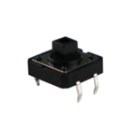

**택트 스위치의 그림**

택트 스위치는 사용자의 입력에 따라 디지털 신호인 HIGH, LOW를 측정하여 아두이노 보드로 송신하는 부품입니다.

택트 스위치는 내부에 **풀업 저항**을 갖고 있어, 외부에서 별도로 5V 전원을 스위치에 연결하지 않아도 입력 핀으로 안정적인 신호를 공급할 수 있다는 장점이 있습니다.

### 하드웨어 연결

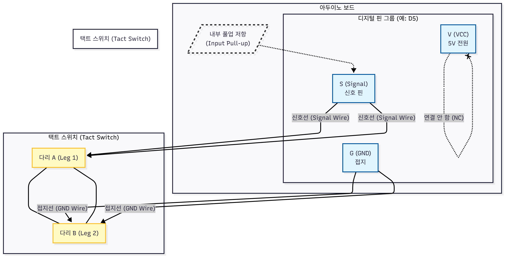

**택트 스위치의 연결도**

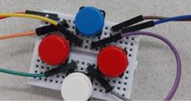

**브레드 보드와 택트 스위치의 연결**

택트 스위치는 사진과 같이 두 개의 단자를 통해 아두이노와 연결됩니다.

* **스위치 다리 A:** 아두이노의 디지털 입력 핀(S)에 연결합니다.
* **스위치 다리 B:** 아두이노의 접지(GND)에 연결합니다.

스위치 다리 A와 B는 택트 스위치의 전면부와 후면부에 각각 한 쌍으로 연결되어 있고, 두 쌍 중 임의의 한 쌍을 선택하여 연결하면 됩니다. 또한 두 다리의 극성은 구분되어 있지 않으므로 사용자의 편의에 따라 극성을 정해 사용할 수 있습니다.

또한, 택트 스위치는 컨트롤러에 들어가는 부품 중 유일하게 아두이노 부품 연결에 사용하는 점퍼 케이블과 직접 연결되지 않아 **미니 브레드보드**를 사용해야 합니다. 선행 기술 조사에서 확인했듯이 컨트롤러에는 일반적으로 **X, Y, A, B 버튼**이 시계 반대 방향으로 배치되어 있기 때문에, 미니 브레드보드에도 똑같은 형식으로 사진에 따라 버튼을 연결합니다.

---

### 소프트웨어 제어 (functions_button)

택트 스위치를 모두 아두이노에 연결하면, 다음과 같은 코드를 사용하여 제어합니다.

**functions_button.ino 함수들의 흐름도**

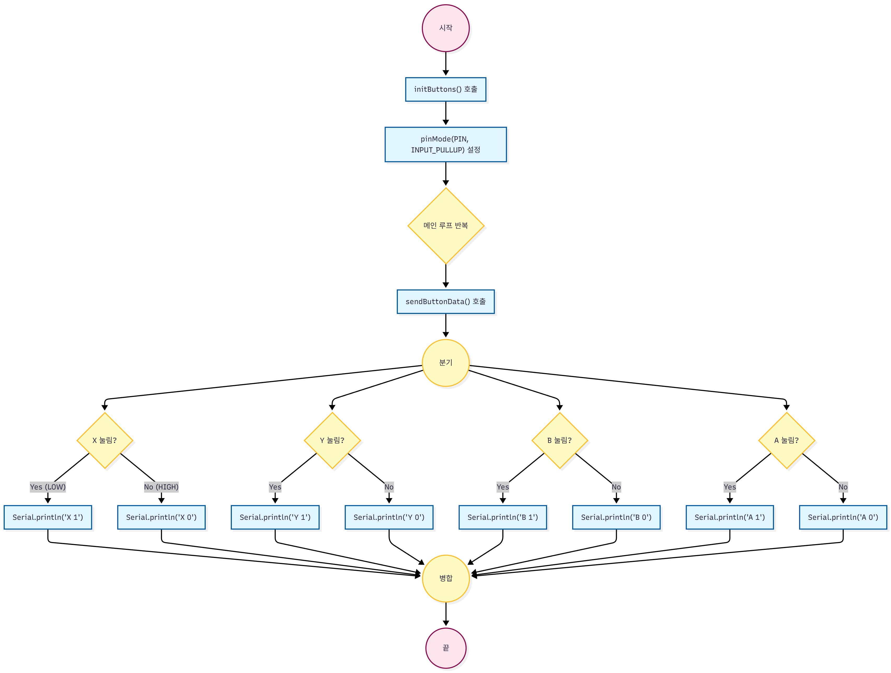

**functions_button.ino**

```c
/**
 * @name initButtons
 * @brief 버튼 핀 4개를 INPUT_PULLUP 모드로 초기화합니다.
 */
void initButtons() {
  pinMode(BUTTON_PIN_X, INPUT_PULLUP);
  pinMode(BUTTON_PIN_Y, INPUT_PULLUP);
  pinMode(BUTTON_PIN_B, INPUT_PULLUP);
  pinMode(BUTTON_PIN_A, INPUT_PULLUP);
}

/**
 * @name sendButtonData
 * @brief 버튼 4개의 상태를 "B[번호] ON/OFF" 양식으로 블루투스 전송
 */
void sendButtonData() {
  // 1. 버튼 값 읽기 (INPUT_PULLUP)
  // - 안 누르면 HIGH(1)
  // - 누르면 LOW(0)
  
  // X 전송
  Serial.print("X "); 
  if (digitalRead(BUTTON_PIN_X) == LOW) {
    Serial.println("1");
  } else {
    Serial.println("0");
  }

  // Y 전송
  Serial.print("Y ");
  if (digitalRead(BUTTON_PIN_Y) == LOW) {
    Serial.println("1");
  } else {
    Serial.println("0");
  }

  // B 전송
  Serial.print("B ");
  if (digitalRead(BUTTON_PIN_B) == LOW) {
    Serial.println("1");
  } else {
    Serial.println("0");
  }

  // A 전송
  Serial.print("A ");
  if (digitalRead(BUTTON_PIN_A) == LOW) {
    Serial.println("1");
  } else {
    Serial.println("0");
  }
}
```

**functions_main.ino에서의 버튼 초기화 및 호출**

```c
// 라이브러리 및 전역 변수 선언부 (생략)

// 버튼 핀 추가
const int BUTTON_PIN_X = 5;
const int BUTTON_PIN_Y = 6;
const int BUTTON_PIN_B = 7;
const int BUTTON_PIN_A = 8;

void setup() {
  initButtons();  // 버튼 핀 설정 (INPUT_PULLUP)
  // ... (다른 초기화 함수들)
}

void loop() {
  // ... (수신 데이터 확인)

  // 데이터 전송 스케줄링 (100ms 주기)
  unsigned long currentMillis = millis();
  if (currentMillis - previousMillis >= interval) {
    previousMillis = currentMillis;

    sendButtonData();   // 버튼 상태 전송 (X, Y, B, A)
  
    // ... (다른 센서 전송)
  }
  
  // ... (연결 상태 감시)
}
```

택트 스위치의 소프트웨어 제어는 크게 초기화 단계(`initButtons` 함수의 운용)와 데이터 전송 단계(`sendButtonData` 함수의 운용)로 나뉩니다.

먼저 `initButtons` 함수는 `setup` 함수 내에서 호출되어 각 버튼에 연결된 핀을 **`INPUT_PULLUP`** 모드로 설정합니다. 이는 아두이노 내부의 풀업 저항을 활성화하여 버튼이 눌리지 않았을 때도 안정적인 **HIGH** 신호를 유지하게 해줍니다.

다음으로, `sendButtonData` 함수는 `loop` 함수 내에서 주기적으로 호출되며 `digitalRead` 함수를 통해 각 버튼 핀의 신호를 읽습니다. 풀업 저항 설정으로 인해 버튼을 누르면 **LOW** 신호가 되고, 누르지 않은 경우에는 **HIGH** 신호를 유지하게 됩니다. 이 신호를 읽어 Serial 통신으로 Unity에 보낼 명령어를 출력합니다. 명령어는 **"버튼 이름, 버튼 상태"** 순서로 출력하며, 예를 들어 X 버튼이 눌린 경우 "X 1"을 출력하도록 합니다.

---

## 블루투스 모듈 (HC-06)

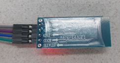

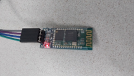

**HC-06의 사진 (첫번째 사진의 단자 이름은 위에서 아래로 순서대로 VCC, GND, TXD, RXD입니다.)**

HC-06은 아두이노와 PC(Unity) 사이의 무선 데이터 통신을 책임지는 아주 중요한 부품입니다. 이 모듈은 블루투스 SPP(Serial Port Profile)라는 걸 사용하는데, PC가 연결 요청을 하면 받아주는 슬레이브(Slave) 모드로 작동합니다.

쉽게 말해서 HC-06은 아두이노의 유선 시리얼 통신을 무선으로 바꿔주는 **'무선 시리얼 케이블'** 같은 역할을 합니다. 덕분에 우리는 복잡한 무선 통신 코드를 짤 필요 없이, 기존에 쓰던 시리얼 통신 코드를 그대로 사용할 수 있죠.

### 하드웨어 연결

**HC-06 블루투스 모듈의 연결도**

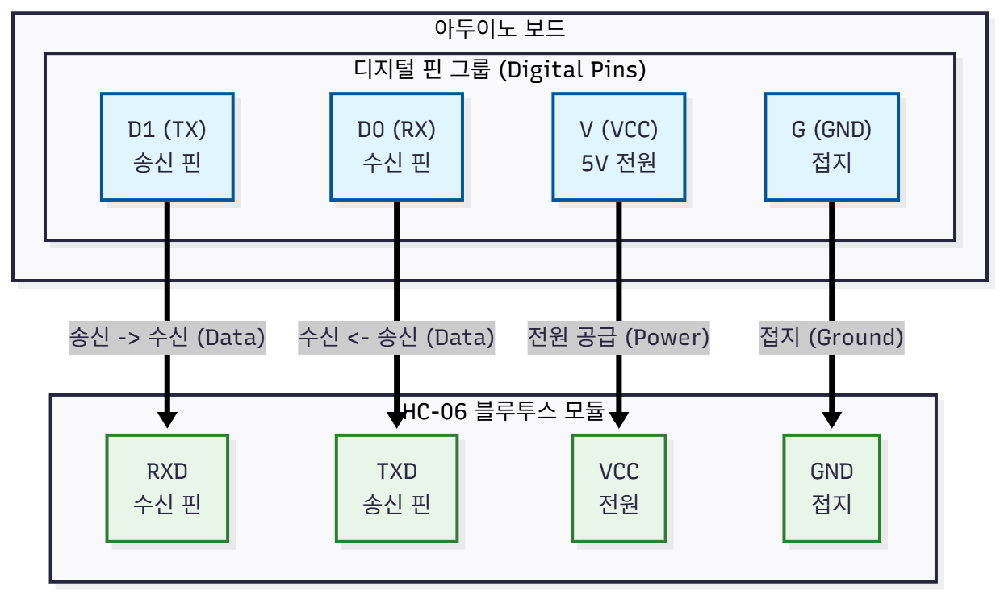

HC-06은 위 그림처럼 4개의 핀으로 아두이노와 연결됩니다. `VCC`와 `GND`는 전원을 연결하는 거고, 데이터를 주고받는 `TXD`랑 `RXD` 핀은 서로 교차해서 연결(Cross-connection)해야 합니다. 즉, HC-06의 `TXD`(보내기)는 아두이노의 `RX`(받기, 0번) 핀에, `RXD`(받기)는 아두이노의 `TX`(보내기, 1번) 핀에 연결하는 거죠.

저희는 통신 속도랑 안정성을 최대한 높이기 위해서 `SoftwareSerial` 대신 아두이노의 하드웨어 시리얼 포트(0번, 1번 핀)를 사용했습니다. 단, 이 핀은 USB 통신이랑 공유되기 때문에, **코드를 업로드할 때는 충돌을 막기 위해 HC-06의 전원(VCC) 선을 잠깐 뽑아주셔야 합니다.**

HC-06 모듈의 제어와 통신을 관리하는 코드는 **functions_etc에서 관리**합니다. 그 까닭은 HC-06이 아두이노가 Serial.print 명령을 보내는 **0번 핀, 1번 핀**과 연결되어 있어 아두이노가 내보내는 데이터를 그대로 무선으로 컴퓨터에 전달하기 때문입니다. 즉, HC-06이 연결되어 있지 않은 상태라면 USB를 통하여 Serial의 명령어가 송신됩니다. 따라서 initSerial 함수에서 특정 버튼을 누르면 통신 모드를 바꿀 수 있는 기능은 HC-06의 연결 여부에 따라 결정합니다. 만일 USB 통신만 사용한다면 115200 bps 통신만을 남겨두고, HC-06 통신만 사용한다면 9600 bps 통신만을 남깁니다. 만일 두 통신 방식을 혼용한다면  앞선 initSerial 함수 그대로 사용합니다.

---

## 기울기/가속도 센서 (MPU6050)

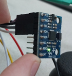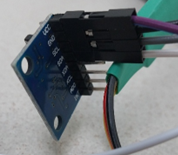

**MPU6050 센서 모듈의 사진**

MPU6050은 3축 자이로스코프랑 3축 가속도계가 하나로 합쳐진 6축 모션 트래킹 센서입니다. 이 센서는 물체의 기울기, 회전 속도, 충격 같은 걸 측정해서 디지털 신호로 보내주는데, 아두이노랑은 **I2C**라는 통신 방식으로 대화합니다.

저희는 이 센서로 컨트롤러가 얼마나 기울어졌는지 측정해서 Unity에 있는 미로판 같은 오브젝트를 실시간으로 움직이는 데 씁니다. 특히 가속도 센서 데이터랑 자이로 센서 데이터를 상보 필터(Complementary Filter)로 잘 섞어서, 노이즈는 없애고 드리프트 현상은 바로잡아서 아주 정밀하게 움직이도록 만들었습니다.

### 하드웨어 연결

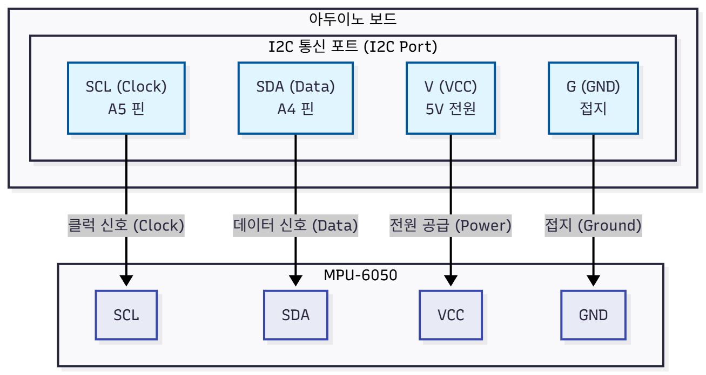

**MPU6050의 연결도**

MPU6050은 그림처럼 4개 핀으로 아두이노와 연결합니다. `VCC`랑 `GND`는 전원이고, I2C 통신을 위한 `SCL` 핀은 아두이노 A5 핀에, `SDA` 핀은 A4 핀에 연결합니다.

저희 프로젝트에는 0.96인치 OLED 디스플레이도 있는데, 얘도 I2C 통신을 쓰거든요. 그래서 MPU6050이랑 OLED는 물리적으로 똑같은 A4, A5 핀을 같이 씁니다(병렬연결). 아두이노가 I2C 주소(Address)를 보고 "이건 센서 꺼, 저건 화면 꺼" 하고 알아서 구별하니까 걱정 안 하셔도 됩니다.

---

### 소프트웨어 제어 (functions_mpu)

**functions_mpu.ino 함수들의 흐름도**

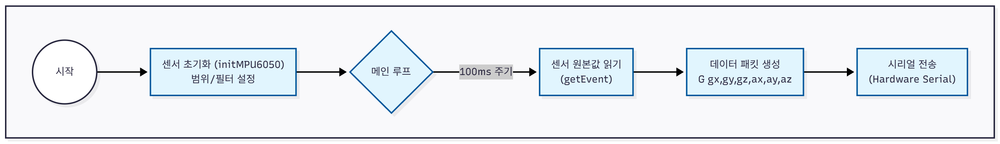

**functions_mpu.ino 함수**

```c
/*
 * @name initMPU6050
 * @brief MPU6050 센서를 찾고, 범위를 설정하여 초기화합니다.'
 */
void initMPU6050() {
  if (!mpu.begin()) {
    while (1) { delay(10); }
  }
  
  // 센서 범위 설정
  mpu.setAccelerometerRange(MPU6050_RANGE_2_G);
  mpu.setGyroRange(MPU6050_RANGE_250_DEG);
  mpu.setFilterBandwidth(MPU6050_BAND_21_HZ);
}

/**
 * @name sendSensorData
 * @brief MPU6050에서 RAW 6축 값을 읽어, 정해진 양식("G ...")으로 블루투스 전송
 */
void sendSensorData() {
  // 1. 센서 값 읽기 (RAW 데이터)
  sensors_event_t a, g, temp;
  mpu.getEvent(&a, &g, &temp);

  // 2. 블루투스로 데이터 전송 (새로운 양식: "G [값6개]")
  Serial.print("G "); // 데이터 종류 'G' (Gyro+Accel)
  
  // 자이로 3축 (rad/s)
  Serial.print(g.gyro.x); Serial.print(",");
  Serial.print(g.gyro.y); Serial.print(",");
  Serial.print(g.gyro.z); Serial.print(",");
  
  // 가속도 3축 (m/s^2)
  Serial.print(a.acceleration.x); Serial.print(",");
  Serial.print(a.acceleration.y); Serial.print(",");
  Serial.println(a.acceleration.z); // println으로 한 줄 마무리
}
```

**functions_main.ino에서의 센서 초기화 및 호출**

```c
// 라이브러리 및 전역 변수 선언부 (생략)
// ...
Adafruit_MPU6050 mpu; // MPU6050 객체

void setup() {
  initMPU6050();  // MPU6050 센서 설정
  // ... (다른 초기화 함수들)
}

void loop() {
  // ... (수신 데이터 확인)

  // 데이터 전송 스케줄링 (100ms 주기)
  unsigned long currentMillis = millis();
  if (currentMillis - previousMillis >= interval) {
    previousMillis = currentMillis;

    sendSensorData();   // IMU 6축 데이터 전송
  
    // ... (다른 센서 전송)
  }
  
  // ... (연결 상태 감시)
}
```

MPU6050 센서 제어는 하드웨어랑 라이브러리를 초기화하는 `initMPU6050` 함수, 그리고 6축 데이터를 읽어서 보내는 `sendSensorData` 함수로 구성됩니다.

`initMPU6050` 함수는 `setup` 단계에서 호출돼서 `Adafruit_MPU6050` 라이브러리를 켜고, 센서 측정 범위랑 노이즈를 걸러주는 필터 설정을 합니다.

`sendSensorData` 함수는 메인 루프에서 100ms마다 호출되는데, 센서에서 가속도랑 자이로 원본(RAW) 데이터를 읽어옵니다. 그리고 아두이노에서 복잡한 계산을 하지 않고, **"G 자이로X,자이로Y,자이로Z,가속도X,가속도Y,가속도Z"** 같은 문자열로 바꿔서 바로 PC(Unity)로 쏴줍니다. 이렇게 하면 아두이노가 힘들어하지 않고, 계산은 성능 좋은 PC가 알아서 하니까 전체적으로 반응 속도도 빠르고 정확해집니다.

---


## 조이스틱 모듈 (Joystick)

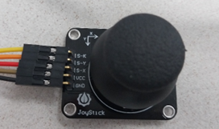

**조이스틱 모듈의 사진**

조이스틱 모듈은 컨트롤러에서 **방향 조종**을 담당하는 핵심 입력 장치입니다. 우리가 흔히 쓰는 게임 패드의 아날로그 스틱이랑 똑같은 거예요. 내부에는 X축, Y축 방향으로 가변저항이 두 개 들어있어서 스틱을 기울이면 전압이 변하고, 그걸로 아날로그 좌표값을 알아냅니다. 그리고 스틱을 꾹 누르면 작동하는 버튼도 하나 숨겨져 있죠.

---


### 하드웨어 연결

**조이스틱 모듈의 연결도**

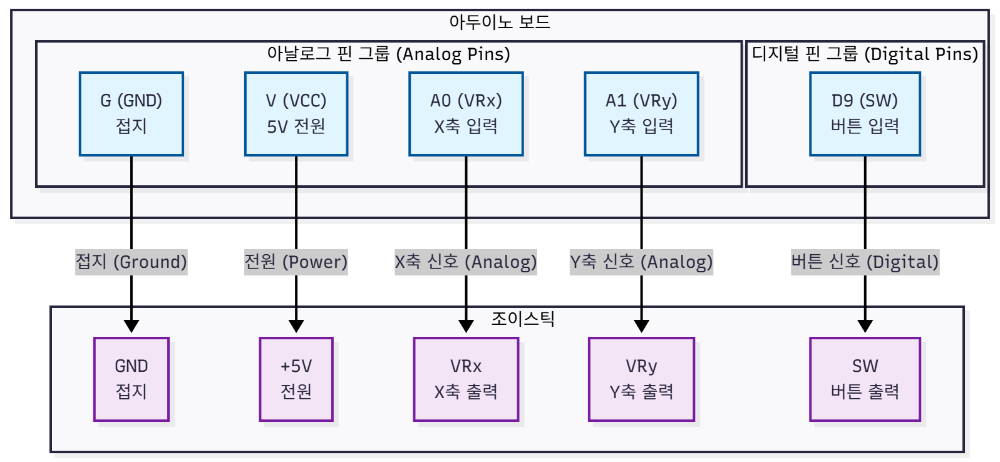

조이스틱 모듈은 연결도처럼 5개 핀을 씁니다. `VCC`, `GND`는 전원이고, `VRx`, `VRy`는 X축, Y축 아날로그 신호라서 아두이노의 아날로그 핀(A0, A1)에 연결합니다. 스틱 버튼 핀(`SW`)은 디지털 핀 D9에 연결하는데, 아두이노 내부 풀업 저항을 쓰니까 따로 저항 달 필요 없이 선만 꽂으면 됩니다.

---


### 소프트웨어 제어 (functions_joystick)

**functions_joystick.ino 함수들의 흐름도**

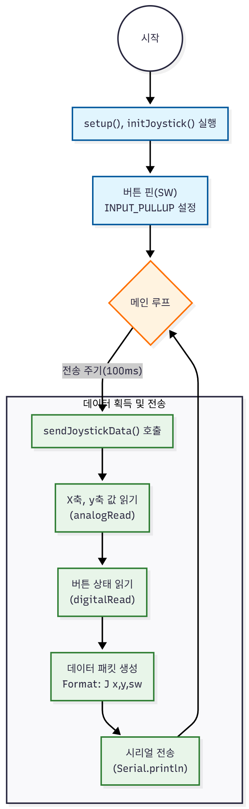

**functions_joystick.ino 함수**

```c
/**
 * @name sendJoystickData
 * @brief 조이스틱 값을 "J x,y,sw" 양식으로 블루투스 전송
 */
void sendJoystickData() {
  // 1. 아날로그 값 2개 읽기 (0 ~ 1023)
  int joyX = analogRead(joyX_Pin);
  int joyY = analogRead(joyY_Pin);

  // 2. 디지털 값 1개 읽기 (INPUT_PULLUP: 안 누르면 1, 누르면 0)
  int joySW = digitalRead(joySW_Pin);

  // 3. J:x,y,button 형식으로 블루투스 전송
  Serial.print("J "); // 키: "J"
  Serial.print(joyX);
  Serial.print(",");
  Serial.print(joyY);
  Serial.print(",");
  Serial.println(joySW); 
}
```

**functions_main.ino에서의 조이스틱 초기화 및 호출**

```c
// functions_main.ino 파일 일부

// ◀️ 조이스틱 핀 추가
const int joyX_Pin = A0; // X축
const int joyY_Pin = A1; // Y축
const int joySW_Pin = 9; // 버튼 (D9)

void setup() {
  // 조이스틱 버튼 핀 초기화
  pinMode(joySW_Pin, INPUT_PULLUP); 
  // ... (다른 초기화 함수들)
}

void loop() {
  // ...

  // 2. 데이터 전송 스케줄링 (100ms 주기)
  unsigned long currentMillis = millis();
  if (currentMillis - previousMillis >= interval) {
    previousMillis = currentMillis;
  
    // 각 센서 데이터 전송 함수 호출
    // ...
    sendJoystickData(); // 조이스틱 (J ...) 데이터 전송
    // ...
  }
}
```

조이스틱 제어는 핀 설정하는 `initJoystick` 함수랑 좌표값 보내는 `sendJoystickData` 함수로 되어 있습니다.

`initJoystick`은 `setup` 단계에서 실행되는데, 아날로그 핀은 따로 설정할 필요 없고 버튼 핀(D9)만 `INPUT_PULLUP` 모드로 설정해 줍니다.

`sendJoystickData`는 메인 루프에서 계속 실행되면서 `analogRead`로 X, Y축 위치(0~1023)를 읽고, `digitalRead`로 버튼 상태를 읽습니다. 그리고 이 값들을 **"J X값,Y값,스위치값"** 형태의 문자열로 만들어서 Unity로 쏘아 보냅니다.

---


## OLED 디스플레이 (Display)

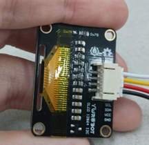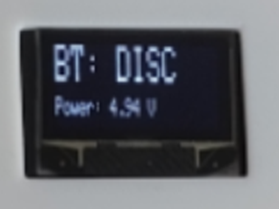

**0.96인치 OLED 디스플레이 모듈의 사진**

저희 컨트롤러에는 사용자가 보기 편하라고 0.96인치 OLED 디스플레이를 달았습니다. 여기에는 현재 유선인지 무선인지, 블루투스는 연결됐는지, 전압은 괜찮은지 같은 정보가 실시간으로 뜹니다. OLED는 백라이트 없이 스스로 빛을 내서 전기도 적게 먹고 야외에서도 잘 보여서 아주 딱입니다. 통신 방식은 아까 MPU6050이랑 똑같은 **I2C**를 씁니다.

### 하드웨어 연결


**OLED 디스플레이의 연결도**

OLED 모듈은 **연결도**처럼 핀 4개를 씁니다. 아까 말했듯이 아두이노 I2C 포트(A4, A5)는 이미 MPU6050이 쓰고 있죠? 그래서 OLED도 같은 라인에 **병렬로 연결**해서 같이 씁니다. I2C는 주소(Address)로 구분하니까 MPU6050(0x68)이랑 OLED(0x3C)가 서로 안 싸우고 사이좋게 작동합니다.

### 소프트웨어 제어 (functions_oled)

**functions_oled.ino 함수들의 흐름도**

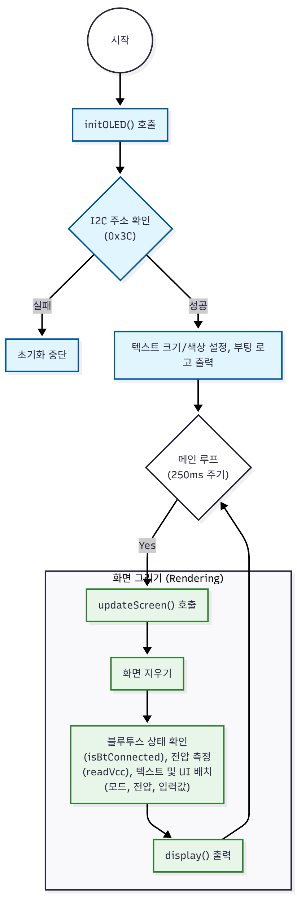

**functions_oled.ino 함수**

```c
/**
 * @name initOLED
 * @brief OLED 초기화 (128x32 해상도)
 */
void initOLED() {
  // 128x32 OLED는 보통 0x3C 주소를 씁니다.
  if(!display.begin(SSD1306_SWITCHCAPVCC, 0x3C)) { 
    Serial.println(F("SSD1306 allocation failed"));
    // (만약 실패하면 주소를 0x3D로 바꿔보세요)
    return;
  }
  
  display.clearDisplay();
  display.setTextSize(1);
  display.setTextColor(WHITE);
  
  // 로고 출력
  display.setCursor(0, 10);
  display.println(F("   Arduino Controller"));
  display.display();
  delay(1000); 
}

long readVcc() {
  // 1. 내부 기준 전압(1.1V)을 측정하도록 설정 (복잡한 레지스터 조작)
  ADMUX = _BV(REFS0) | _BV(MUX3) | _BV(MUX2) | _BV(MUX1);
  
  delay(2); // 안정화 대기
  ADCSRA |= _BV(ADSC); // 측정 시작!
  while (bit_is_set(ADCSRA,ADSC)); // 측정 끝날 때까지 기다림

  // 2. 측정값 읽기
  uint8_t low  = ADCL; 
  uint8_t high = ADCH;
  long result = (high<<8) | low;

  // 3. 역산 (계산)
  // 1125300 = 1.1V * 1023 * 1000 (상수)
  result = 1125300L / result; 
  
  return result; // 결과: 밀리볼트 (mV) 단위 (예: 4985mV)
}

/**
 * @name updateScreen
 * @brief 블루투스 연결 상태와 전압만 심플하게 표시
 */
void updateScreen() {
  display.clearDisplay();
  display.setTextColor(WHITE);

  // ---------------------------------------------------------
  // 1. 블루투스 연결 상태 (상단, 크게)
  // ---------------------------------------------------------
  display.setTextSize(2); // 큰 글씨
  display.setCursor(0, 0);
  
  if (isBtConnected) {
    display.print(F("BT: CONN")); // 연결됨
  } else {
    display.print(F("BT: DISC")); // 끊김
  }

  // ---------------------------------------------------------
  // 2. 전압 상태 (하단, 작게)
  // ---------------------------------------------------------
  display.setTextSize(1); // 작은 글씨
  display.setCursor(0, 20);
  
  float voltage = readVcc() / 1000.0;
  
  display.print(F("Power: "));
  display.print(voltage, 2); // 소수점 2자리까지 (예: 4.98)
  display.print(F(" V"));

  // 전압이 너무 낮으면 경고 표시 (4.5V 미만)
  if (voltage < 4.5) {
    display.setCursor(90, 20);
    display.print(F("LOW!"));
  }

  display.display();
}
```

**functions_main.ino에서의 OLED 초기화 및 호출**

```c
// functions_main.ino 파일 일부

// OLED 객체 생성
Adafruit_SSD1306 display(SCREEN_WIDTH, SCREEN_HEIGHT, &Wire, OLED_RESET);

// OLED 갱신용 타이머 변수
unsigned long previousOledMillis = 0;
const long oledInterval = 250; // 0.25초마다 화면 갱신

void setup() {
  // ...
  initOLED();       // 디스플레이 초기화
  // ...
}

void loop() {
  // ...

  // 2. 데이터 전송 스케줄링 (100ms 주기)
  unsigned long currentMillis = millis();
  if (currentMillis - previousMillis >= interval) {
    previousMillis = currentMillis;
  
    // ...
  
    // 3. 디스플레이 갱신 스케줄링 (250ms 주기)
    if (millis() - previousOledMillis >= oledInterval) {
       previousOledMillis = millis();
       updateScreen();
    }
  }
}
```

OLED 디스플레이 제어는 `functions_oled.ino` 탭에 있는 코드로 돌아갑니다. `initOLED` 함수는 `setup` 때 실행돼서 I2C 통신을 켜고 화면을 초기화합니다. `updateScreen` 함수는 250ms마다 한 번씩 실행되면서 현재 시스템 상태를 화면에 그려줍니다.

특히 여기서 `readVcc`라는 재미있는 함수를 썼는데요, 이건 아두이노 칩 내부에 있는 1.1V 기준 전압이랑 공급 전압을 비교해서 **아두이노 스스로 자기 전압(Vcc)을 측정**하는 기능입니다. 덕분에 전압 측정 회로를 따로 안 만들어도, 지금 배터리가 얼마나 남았는지(전압이 떨어졌는지) 감시해서 사용자한테 경고해 줄 수 있죠. 그리고 화면 갱신 주기를 250ms로 잡은 건, I2C 통신을 너무 많이 쓰면 센서 데이터 보내는 게 느려질까 봐 조절한 겁니다.

## 진동 모터 (Haptic Feedback)

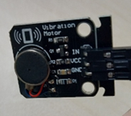

**진동 모터 모듈의 사진**

진동 모터는 게임에서 충돌하거나 아이템을 먹었을 때 손맛(Haptic Feedback)을 느끼게 해주는 출력 장치입니다. 저희는 트랜지스터 구동 회로가 내장된 모듈형 제품을 써서 아두이노 핀에 바로 꽂을 수 있게 만들었습니다. 단순히 켜고 끄는 게 아니라, **PWM** 신호로 진동 세기를 0부터 255까지 미세하게 조절해서 상황에 맞는 다양한 진동 패턴을 만들 수 있습니다.

### 하드웨어 연결


**진동 모터의 연결도**

진동 모터 모듈은 연결도처럼 핀 3개를 씁니다. `VCC`, `GND`, `IN` 핀이 있는데, `IN` 핀을 아두이노의 PWM 핀(D10)에 연결하면 진동 세기를 마음대로 조절할 수 있습니다. 모듈 안에 보호 회로랑 증폭 회로가 다 들어있어서, 복잡한 회로 꾸밀 필요 없이 센서 쉴드에 바로 꽂으면 끝입니다.

### 소프트웨어 제어(functions_vibration)

**functions_vibration.ino 함수들의 흐름도**

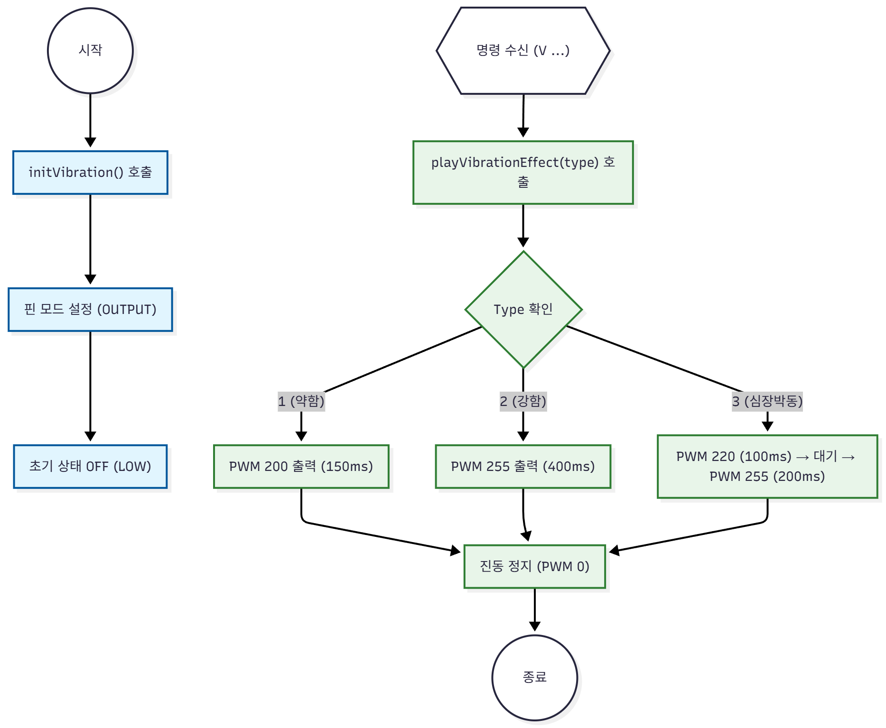

**functions_vibration.ino 함수**

```c
// ---------------------------------
// 진동 모터 관리 함수들
// ---------------------------------

/**
 * @name initVibration
 * @brief 진동 모터 핀을 초기화합니다.
 */
void initVibration() {
  pinMode(VIB_PIN, OUTPUT);
  digitalWrite(VIB_PIN, LOW); // 처음에는 꺼둠
  Serial.println("Vibration Motor Initialized (D10)");
}

/**
 * @name setVibration
 * @brief 진동을 계속 켜거나 끕니다.
 * @param strength 진동 세기 (0:꺼짐 ~ 255:최대)
 */
void setVibration(int strength) {
  analogWrite(VIB_PIN, strength);
}

// ★ [수정됨] 수치를 대폭 올린 진동 패턴 함수
void playVibrationEffect(int type) {
  switch (type) {
    case 1: // [약한 피드백] (아이템 획득 등)
      // 기존 100은 너무 약해서 200으로 올림
      analogWrite(VIB_PIN, 200); 
      delay(150);
      analogWrite(VIB_PIN, 0);
      break;

    case 2: // [강한 충돌] (기존 유지 - 최대 파워)
      analogWrite(VIB_PIN, 255); 
      delay(400); // 시간도 조금 더 길게 (0.4초)
      analogWrite(VIB_PIN, 0);
      break;

    case 3: // [심장박동] (두근.. 두근..)
      // 수치를 220, 255로 올려서 확실하게 끊어치기
      analogWrite(VIB_PIN, 220); // 1. 쿵 (조금 약하게)
      delay(100); 
      analogWrite(VIB_PIN, 0);
  
      delay(100); // 쉬고
  
      analogWrite(VIB_PIN, 255); // 2. 쾅! (강하게)
      delay(200); 
      analogWrite(VIB_PIN, 0);
      break;
  
    default:
      analogWrite(VIB_PIN, 0);
      break;
  }
}
```

**functions_main.ino 및 etc.ino에서의 호출**

```c
// functions_main.ino 파일 일부

const int VIB_PIN = 10; // 진동 모터 핀 (D10)

void setup() {
  // ...
  initVibration();  // 진동 모터 설정
}

// executeCommand 함수 (functions_etc.ino에 포함)
void executeCommand(String cmd) {
  // ...
  // 진동 명령 처리 (예: "V 2")
  if (cmd.startsWith("V")) {
    int vibType = cmd.substring(2).toInt();
    playVibrationEffect(vibType);
  }
}
```

진동 모터 제어는 `functions_vibration.ino` 탭에서 합니다. `initVibration` 함수로 핀을 설정하고 처음엔 꺼둡니다. 핵심은 `playVibrationEffect` 함수인데, Unity에서 정해진 숫자(Type)를 보내면 미리 만들어둔 진동 패턴을 재생해 줍니다. `analogWrite` 함수로 0~255 사이 값을 조절해서 진동 세기를 바꿀 수 있습니다. 예를 들어 아이템 먹으면 짧고 약하게(Type 1), 벽에 부딪히면 길고 강하게(Type 2), 게임 클리어하면 심장 박동처럼 두근두근(Type 3)하게 만들어서 게임 몰입감을 확 높였습니다.

## 스피커 (Passive Buzzer)

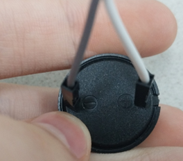

**수동 부저 모듈 사진**

스피커 모듈은 **소리 피드백**을 주는 장치입니다. 저희는 내부에 소리 회로가 없는 수동 부저(Passive Buzzer)를 썼는데요, 이건 단순히 소리를 켜고 끄는 게 아니라 아두이노에서 주파수(Frequency)를 줘서 **도레미파솔라시도** 같은 음계를 연주할 수 있습니다. 덕분에 게임 시작 알림, 버튼 클릭음, 경고음, 성공 효과음 등 상황에 딱 맞는 소리를 낼 수 있죠.

### 하드웨어 연결

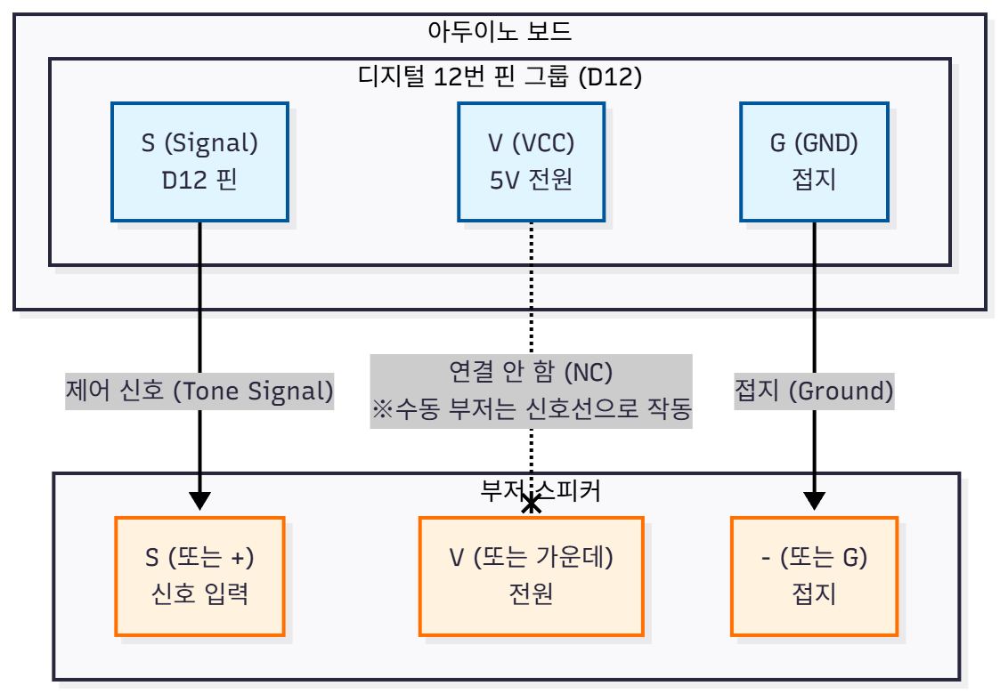

**스피커의 연결도**

스피커 모듈은 연결도처럼 핀 3개를 씁니다. `S` 핀은 아두이노 디지털 핀(D12)에 연결해서 주파수 신호를 받고, `G` 핀은 GND에 연결합니다. 수동 부저는 신호선 전력만으로도 소리가 나서 `V` 핀은 굳이 연결 안 해도 되지만, 모듈에 따라 안정적으로 쓰고 싶으면 5V에 연결해도 됩니다.

### 소프트웨어 제어(functions_speaker)

**functions_speaker.ino 함수들의 흐름도**

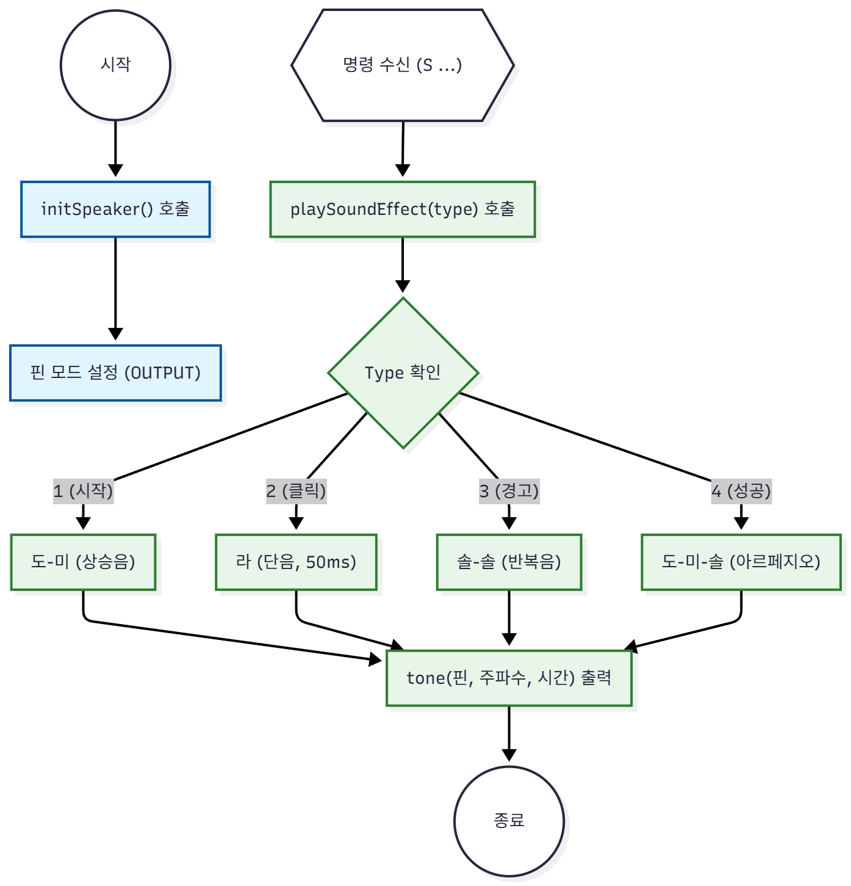

**functions_speaker.ino 함수**

```c
// ---------------------------------
// 스피커 관리 함수들
// ---------------------------------

/**
 * @name initSpeaker
 * @brief 스피커 초기화 및 시작음 재생
 */
void initSpeaker() {
  pinMode(SPEAKER_PIN, OUTPUT);
  Serial.println("Speaker Initialized (D8)");
  
  // 시작 알림음 (솔~ 도!) - 검증된 523Hz 사용
  playSoundEffect(1); 
}

/**
 * @name playSoundEffect
 * @brief 검증된 주파수 대역(440~1000Hz)을 사용한 효과음 재생
 * @param type 효과음 번호 (1:시작, 2:클릭, 3:경고, 4:성공)
 */
void playSoundEffect(int type) {
  switch (type) {
    case 1: // [시작음] "띠-딩" (안정적인 도 -> 미)
      // 523Hz (높은 도)
      tone(SPEAKER_PIN, 523, 150); 
      delay(150); 
      noTone(SPEAKER_PIN);

      // 659Hz (높은 미)
      tone(SPEAKER_PIN, 659, 300); 
      delay(300); 
      noTone(SPEAKER_PIN);
      break;

    case 2: // [클릭/터치] "톡" (짧고 깔끔한 라)
      // 440Hz (라) - 테스트했던 그 소리!
      tone(SPEAKER_PIN, 440, 50); 
      delay(50); 
      noTone(SPEAKER_PIN);
      break;

    case 3: // [경고/충돌] "뿌- 뿌-" (약간 낮은 솔)
      // 392Hz (솔)
      tone(SPEAKER_PIN, 392, 150); 
      delay(150); 
      noTone(SPEAKER_PIN);
  
      delay(100); // 소리 사이 간격

      tone(SPEAKER_PIN, 392, 150); 
      delay(150); 
      noTone(SPEAKER_PIN);
      break;

    case 4: // [성공/아이템] "띠로리~" (도-미-솔)
      // 523Hz (도)
      tone(SPEAKER_PIN, 523, 100); delay(100); noTone(SPEAKER_PIN);
      // 659Hz (미)
      tone(SPEAKER_PIN, 659, 100); delay(100); noTone(SPEAKER_PIN);
      // 784Hz (솔)
      tone(SPEAKER_PIN, 784, 200); delay(200); noTone(SPEAKER_PIN);
      break;
  
    default:
      noTone(SPEAKER_PIN);
      break;
  }
}

/**
 * @name playTone
 * @brief 특정 주파수의 소리를 지정된 시간만큼 재생합니다.
 * @param frequency 주파수 (Hz)
 * @param duration 지속 시간 (ms)
 */
void playTone(int frequency, int duration) {
  tone(SPEAKER_PIN, frequency, duration);
}
```

**functions_main.ino 및 etc.ino에서의 호출**

```c
// 전역 변수 선언
const int SPEAKER_PIN = 12; // 스피커 핀 (D12)

void setup() {
  initSpeaker(); // 스피커 초기화
  // ...
}

// (functions_etc.ino의 executeCommand 함수에서 호출됨)
void executeCommand(String cmd) {
  // ...
  // 소리 명령 처리 (예: "S 1")
  if (cmd.startsWith("S")) {
    int soundType = cmd.substring(2).toInt();
    playSoundEffect(soundType); 
  }
}
```

스피커 제어 로직은 `functions_speaker.ino` 탭에 있습니다. `initSpeaker` 함수로 핀을 설정하고 부팅할 때 알림음을 한 번 울려줍니다. 핵심은 `playSoundEffect` 함수인데, Unity에서 받은 숫자(Type)에 따라 정해진 멜로디를 재생합니다. 아두이노 `tone(핀, 주파수, 시간)` 함수를 쓰는데, 피에조 부저 특성상 너무 높거나 낮은 음은 소리가 찢어지기 쉬워서 가장 듣기 좋은 **400Hz ~ 1000Hz** 대역을 골라 썼습니다. 그리고 음과 음 사이에 `noTone`이랑 `delay`를 잘 섞어서 소리가 뭉개지지 않고 깔끔하게 들리도록 만들었습니다.

## 터치 센서 (Touch Sensor)

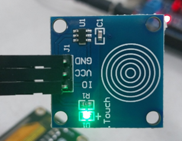

**TTP223 정전식 터치 센서 모듈**

터치 센서는 누르는 힘이 아니라 우리 몸의 전기(정전 용량)를 감지하는 센서입니다. 그래서 살짝 손만 대도 반응하고, 얇은 플라스틱 벽 너머에서도 터치를 감지할 수 있죠. 저희가 쓴 TTP223 모듈은 손가락이 닿으면 **HIGH(1)** 신호를 보내고, 떼면 **LOW(0)** 신호를 보냅니다. 기계적인 부품이 없어서 고장도 잘 안 나고 반응도 빨라서, 부스터나 메뉴 같은 특수 기능 버튼으로 쓰기 딱 좋습니다.

### 하드웨어 연결

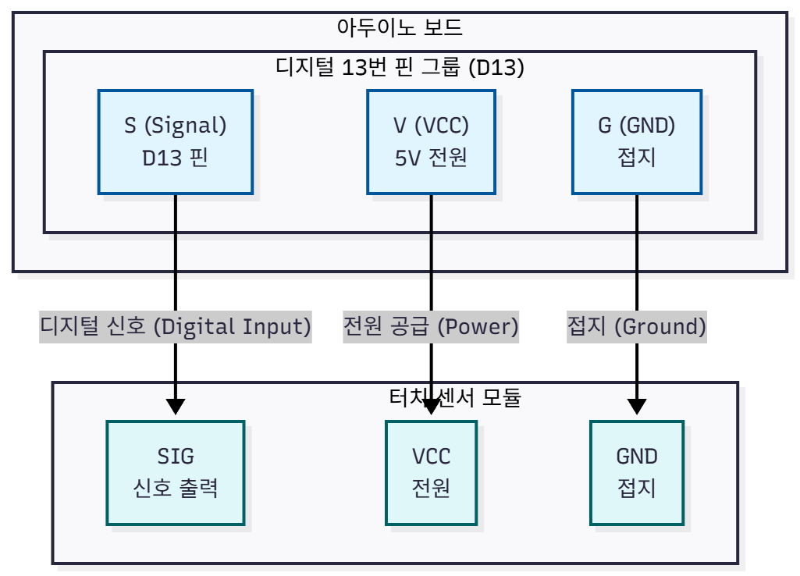

**터치 센서의 연결도**

터치 센서 모듈은 연결도처럼 핀 3개를 씁니다. `VCC`, `GND`는 전원이고, `SIG` 핀은 신호를 보내니까 아두이노 디지털 핀(D13)에 연결합니다. 주의할 점은 택트 스위치랑 다르게 **내부 풀업 저항을 안 쓴다는** 거예요. 모듈이 알아서 전압을 보내주니까 그냥 `INPUT` 모드로 설정하면 됩니다.

### 소프트웨어 제어(functions_touch)

**functions_touch.ino 함수들의 흐름도**

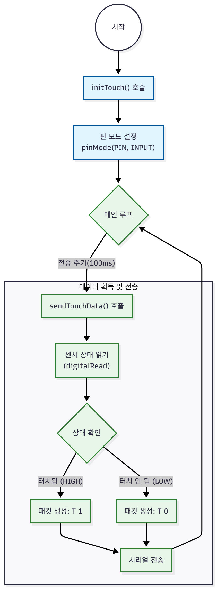

**functions_touch.ino 함수**

```c
// ---------------------------------
// 터치 센서 관리 함수들
// ---------------------------------

/**
 * @name initTouch
 * @brief 터치 센서 핀을 입력 모드로 설정합니다.
 */

void initTouch() {
  pinMode(TOUCH_PIN, INPUT);
}

/**
 * @name sendTouchData
 * @brief 터치 센서 상태를 "T 1" 또는 "T 0"으로 블루투스 전송
 */
void sendTouchData() {
  // 터치 센서 읽기 (터치하면 HIGH(1), 안 하면 LOW(0))
  int touchState = digitalRead(TOUCH_PIN);

  // 1. 블루투스로 전송
  Serial.print("T "); // 키: "T"
  Serial.println(touchState); // 값: 1 or 0 (줄바꿈 포함)
}
```

**functions_main.ino에서의 터치 센서 초기화 및 호출**

```c
// functions_main.ino 파일 일부

// 터치 센서 핀 추가
const int TOUCH_PIN = 13; // 터치 센서 핀 (D13)

void setup() {
  // ...
  initTouch(); // 터치 센서 초기화
  // ...
}

void loop() {
  // ...
  // 데이터 전송 스케줄링 (100ms 주기)
  if (currentMillis - previousMillis >= interval) {
    // ...
    sendTouchData(); // 터치 데이터 전송
  }
}
```

터치 센서 제어는 `functions_touch.ino` 탭에서 합니다. `initTouch` 함수는 `setup` 단계에서 핀을 **`INPUT`** 모드로 설정합니다. 이게 택트 스위치(`INPUT_PULLUP`)랑 다른 점이에요. `sendTouchData` 함수는 메인 루프에서 계속 실행되면서 `digitalRead`로 센서 값을 읽습니다. 터치되면  **1** , 안 되면 **0**을 읽어서 "T 1"이나 **"T 0"** 형식으로 Unity에 보내줍니다.

## 전원 공급 장치 (Battery & Power)

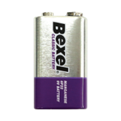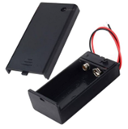

**9V 배터리 및 홀더의 사진**

무선 컨트롤러니까 당연히 선 없이도 켜져야겠죠? 그래서 저희는 **9V 배터리**를 주 전원으로 골랐습니다. 아두이노 우노는 5V로 작동하지만, 내부에 레귤레이터라는 게 있어서 **7V~12V** 사이 전압을 넣어주면 알아서 5V로 낮춰서 씁니다. 그래서 9V 배터리가 딱이죠. 중간에는 **슬라이드 스위치**를 달아서 필요할 때만 켜고 끌 수 있게 만들었습니다.

배터리 연결 방법은 **센서 확장 쉴드를 쓰느냐 안 쓰느냐**에 따라 두 가지가 있습니다.

**1. 센서 확장 쉴드를 쓰는 경우 (추천!)**
쉴드를 쓰면 **`Vin`** 핀이 밖으로 나와 있어서 연결하기가 훨씬 편합니다. DC 잭(검은색 둥근 구멍)을 안 쓰고 핀에 바로 꽂으니까 USB 케이블이랑 서로 걸리적거리지도 않고요.

* **(+) 빨간 선:** 스위치를 거쳐서 쉴드의 **`Vin`** 핀에 꽂으세요. (절대로 `5V`에 꽂으면 안 됩니다! 보드 타요!)
* **(-) 검은 선:** 쉴드의 **`GND`** 핀에 꽂으세요.

**2. 아두이노 보드에 직접 연결하는 경우**
쉴드 없이 아두이노만 쓴다면, 배터리 홀더 끝에 달린 **DC 플러그**를 아두이노의 검은색 전원 소켓에 바로 꽂는 게 제일 안전하고 편합니다. 만약 플러그가 없다면 점퍼선을 이용해서 보드에 있는 `Vin`과 `GND` 구멍에 직접 꽂아야 하는데, 이건 조금 번거로울 수 있습니다.

저희 프로젝트에서는 공간도 아끼고 선 정리도 깔끔하게 하려고 **1번(센서 쉴드 핀 연결)** 방식을 선택했습니다.
