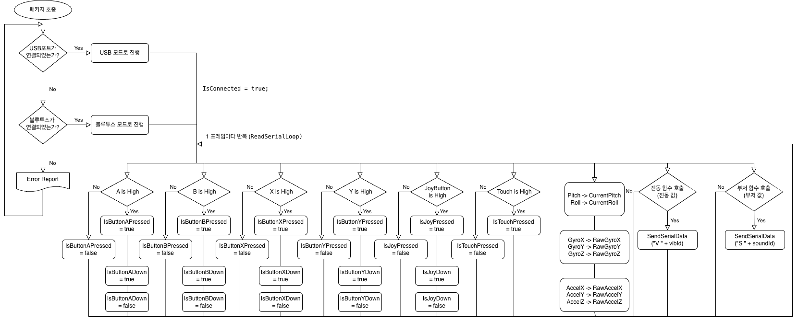
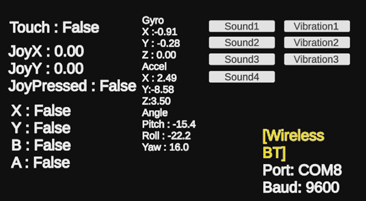
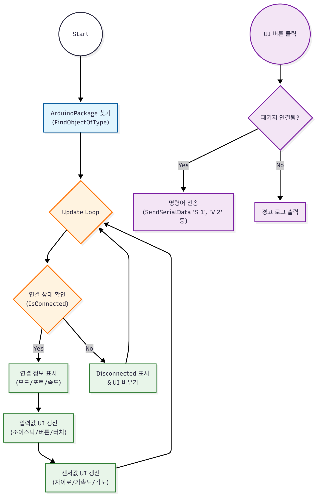
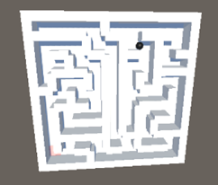
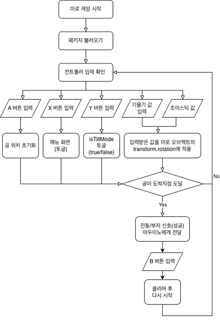
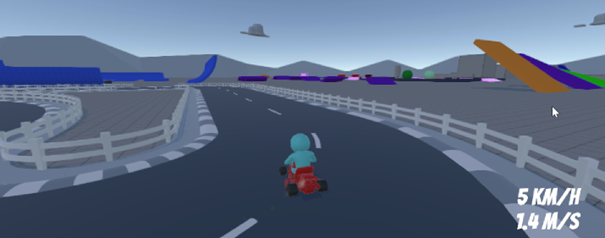
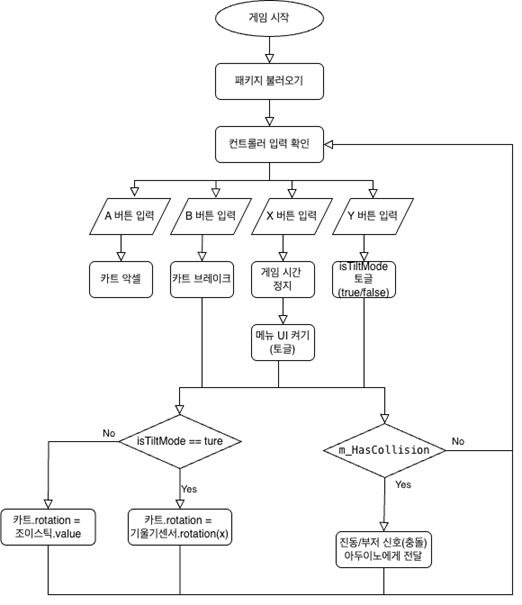
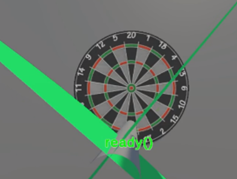
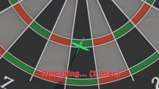

# 소프트웨어 개발

## ArduinoPackage 스크립트

**ArduinoPackage 스크립트의 흐름도**



### 개요

`ArduinoPackage`는 Unity와 아두이노 컨트롤러 간의 시리얼 통신을 관리하고, 하드웨어의 모든 입출력 데이터를 중계하는 핵심 컴포넌트입니다.
`MonoBehaviour`를 상속받으며, 게임 시작 시 자동으로 연결을 시도하고(`Start`), 매 프레임 데이터를 갱신(`Update`)합니다. 또한, 버튼의 '눌림 상태(Press)'와 '누르는 순간(Down)'을 구분하여 처리하는 로직이 내장되어 있습니다.

* **Inherits:** `MonoBehaviour`

### 인스펙터 설정

Unity 에디터에서 설정할 수 있는 옵션입니다.

| 속성 (Property)         | 기능 (Description)                                                        | 기본값     |
| ----------------------- | ------------------------------------------------------------------------- | ---------- |
| **Use Usb Mode**  | 체크 시 유선(USB) 모드(115200), 해제 시 무선(BT) 모드(9600)로 연결합니다. | `false`  |
| **Bt Port Name**  | 무선 연결 시 사용할 포트 번호 (예: COM8)                                  | `"COM8"` |
| **Bt Baud Rate**  | 무선 통신 속도                                                            | `9600`   |
| **Usb Port Name** | 유선 연결 시 사용할 포트 번호 (예: COM5)                                  | `"COM5"` |
| **Usb Baud Rate** | 유선 통신 속도                                                            | `115200` |
| **Filter Weight** | 상보 필터 가중치 (높을수록 자이로 의존도 높음)                            | `0.90`   |
| **Dead Zone**     | 조이스틱 입력의 데드존 범위 (0.0 ~ 1.0)                                   | `0.15`   |

### 필드 및 프로퍼티 (Field & Property)

#### 연결 상태 (Connection)

| 타입       | 이름                          | 설명                                             |
| ---------- | ----------------------------- | ------------------------------------------------ |
| `bool`   | **`IsConnected`**     | 현재 아두이노와 연결되어 통신 중인지 여부입니다. |
| `string` | **`CurrentPortName`** | 현재 연결을 시도했거나 연결된 포트 이름입니다.   |
| `int`    | **`CurrentBaudRate`** | 현재 설정된 통신 속도입니다.                     |

#### IMU 센서 데이터 (Motion)

| 타입      | 이름                        | 설명                                                    |
| --------- | --------------------------- | ------------------------------------------------------- |
| `float` | **`CurrentPitch`**  | 상보 필터가 적용된**Pitch (상하 회전)**각도입니다.      |
| `float` | **`CurrentRoll`**   | 상보 필터가 적용된**Roll (좌우 회전)**각도입니다.       |
| `float` | **`CurrentYaw`**    | 자이로 적분을 통해 계산된**Yaw (수평 회전)**각도입니다. |
| `float` | **`RawGyroX/Y/Z`**  | 센서로부터 수신한 자이로스코프 원본 데이터입니다.       |
| `float` | **`RawAccelX/Y/Z`** | 센서로부터 수신한 가속도계 원본 데이터입니다.           |

#### 조이스틱 입력 (Joystick)

| 타입      | 이름                       | 설명                                                                  |
| --------- | -------------------------- | --------------------------------------------------------------------- |
| `float` | **`JoyX`**         | 조이스틱 X축 입력값입니다. (-1.0 ~ 1.0)                               |
| `float` | **`JoyY`**         | 조이스틱 Y축 입력값입니다. (-1.0 ~ 1.0)                               |
| `bool`  | **`IsJoyPressed`** | 조이스틱 버튼이 현재 눌려있는지(Hold) 여부입니다.                     |
| `bool`  | **`IsJoyDown`**    | 조이스틱 버튼을**누르는 순간(One-shot)** `true`를 반환합니다. |

Sheets로 내보내기

#### 버튼 및 터치 입력 (Buttons & Touch)

버튼 입력은 상태(Pressed)와 **이벤트(Down)** 두 가지 형태로 제공됩니다.

| 타입     | 이름 (Pressed / Down)                                      | 설명                                                 |
| -------- | ---------------------------------------------------------- | ---------------------------------------------------- |
| `bool` | **`IsButtonAPressed`**/**`IsButtonADown`** | **A 버튼**의 눌림 유지 / 누르는 순간 감지      |
| `bool` | **`IsButtonBPressed`**/**`IsButtonBDown`** | **B 버튼**의 눌림 유지 / 누르는 순간 감지      |
| `bool` | **`IsButtonXPressed`**/**`IsButtonXDown`** | **X 버튼**의 눌림 유지 / 누르는 순간 감지      |
| `bool` | **`IsButtonYPressed`**/**`IsButtonYDown`** | **Y 버튼**의 눌림 유지 / 누르는 순간 감지      |
| `bool` | **`IsTouchPressed`**                               | **터치 센서**의 접촉 여부입니다. (Down 미지원) |

### 주요 메서드 (Methods)

#### `public void Connect()`

설정된 포트와 속도로 시리얼 연결을 1회 시도합니다. `Start()` 시 코루틴을 통해 자동으로 재시도 연결이 수행되므로, 보통은 수동으로 재연결할 때 사용합니다.

#### `span`

현재 열려있는 시리얼 포트를 닫고 통신을 종료합니다. 애플리케이션 종료 시 자동으로 호출됩니다.

#### `span`

아두이노로 문자열 명령어를 전송합니다.

* **Parameters:** `message` - 전송할 명령어 (예: "S 1", "V 2")

---

## ArduinoPackage 예제 코드

### 예제 1: 기울기 센서로 오브젝트 회전시키기

`CurrentPitch`, `CurrentRoll`, `CurrentYaw`를 사용하여 게임 오브젝트를 회전시키는 예시입니다.

**C#**

```clike
public class ObjectRotator : MonoBehaviour
{
    // 1. 아두이노 패키지 참조
    public ArduinoPackage arduino;

    void Update()
    {
        if (arduino.IsConnected)
        {
            // 2. 센서 값 가져오기
            float pitch = arduino.CurrentPitch;
            float roll = arduino.CurrentRoll;
            float yaw = arduino.CurrentYaw;

            // 3. 오브젝트 회전에 적용
            transform.rotation = Quaternion.Euler(pitch, yaw, -roll);
        }
    }
}
```

### 예제 2: 버튼 입력 처리 (단발성 vs 지속성)

`IsButton...Down`(단발성)과 `IsButton...Pressed`(지속성)의 차이를 활용한 예시입니다.

**C#**

```clike
void Update()
{
    // [단발성] 점프: 버튼을 누르는 순간 딱 한 번만 실행 (UpdateDownStates 로직 활용)
    if (arduino.IsButtonADown)
    {
        Jump();
        Debug.Log("Jump!");
    }

    // [지속성] 부스터: 버튼을 누르고 있는 동안 계속 실행
    if (arduino.IsButtonXPressed)
    {
        ActivateBooster();
        Debug.Log("Booster ON...");
    }
}
```

### 예제 3: 햅틱(진동) 및 사운드 피드백 전송

`SendSerialData` 메서드를 사용하여 아두이노의 진동 모터와 스피커를 제어하는 예시입니다.

**C#**

```clike
public void OnPlayerCollision()
{
    // 충돌 시 '강한 진동(Type 2)'과 '경고음(Type 3)' 명령 전송
    if (arduino.IsConnected)
    {
        arduino.SendSerialData("V 2"); // Vibration Type 2
        arduino.SendSerialData("S 3"); // Sound Type 3
    }
}
```

## 예제 게임 설명

`ArduinoPackage`와 함께 오픈소스로 배포할 예제 씬인 **디버그 룸**과 **공-미로 게임, 레이싱 게임, 다트 게임**은 ` ArduinoPackage`의 구성 요소들을 실질적으로 적용하여 플레이어가 아두이노 컨트롤러를
가지고 게임을 조작할 수 있도록 제작되었습니다.

해당 예제 게임의 소스코드는 개발자들로 하여금 ` ArduinoPackage` 객체를 다루는 방법을 배울 수 있게 하며 실질적인 사용 예시를 확인할 수 있게 돕기 때문에 필수적입니다.

모든 소스 코드는 Arduino_Project 레포지토리에서 ([바로가기](https://github.com/junminMoon/Arduino_Project)) 확인할 수 있으며, 이하 내용은 씬의 논리적 흐름만 설명하도록 하겠습니다.

또한 모든 씬의 내용은 개요 문단에 첨부한 유튜브 영상에서도 확인할 수 있습니다.

### 디버그 씬

**디버그 씬의 시연 화면**



디버그 씬은 컨트롤러의 운용 모드 확인 및 컨트롤러가 송수신할 수 있는 모든 기능을 체험할 수 있는 씬입니다.
해당 씬에는 각 컨트롤러의 값을 표시할 더미 UI 텍스트 오브젝트를 이용해 `ArduinoPackage` 객체의 값을 불러오고, 버튼 UI 오브젝트를 통해 컨트롤러로 신호, 진동 명령을 보냅니다.
그리고 모든 더미 텍스트 및 버튼 입력은 `DebugScene` 스크립트가 관리합니다.

해당 씬의 존재 의의는 개발자가 컨트롤러를 게임에 적용하기 전에 컨트롤러가 제대로 **연결되었는지 확인할 수 있도록 돕는 점**과, `DebugScene` 스크립트에서 모든 송수신 코드를 관리하기 때문에, 개발자가 해당 코드를 참고하여 다른 **게임 개발에 응용할 수 있게 하는 점**에 있습니다.

디버그 씬의 알고리즘을 순서도로 정리하면 아래 그림과 같습니다.

**디버그 씬 스크립트의 순서도**



`DebugScene.cs`는 `ArduinoPackage` 클래스의 기능을 활용하는 가장 모범적인 예시입니다. 주요 로직은 다음과 같이 구성됩니다.

**(1) 패키지 연결 및 초기화 (Initialization)**
스크립트가 시작되면(`Start`), 씬(Scene) 내에 존재하는 `ArduinoPackage` 매니저를 자동으로 탐색하여 연결합니다.

```clike
void Start() {
    // 씬에 있는 ArduinoPackage 객체를 자동으로 찾아 할당
    if (arduinoPackage == null) {
        arduinoPackage = FindObjectOfType<ArduinoPackage>();
    }
}
```

* **응용 포인트:** 개발자는 게임 오브젝트에 일일이 스크립트를 드래그 앤 드롭할 필요 없이, 이 코드를 통해 손쉽게 하드웨어 매니저와 연동할 수 있습니다.

**(2) 실시간 센서 데이터 모니터링 (Polling)**
`Update()` 함수에서는 매 프레임마다 컨트롤러의 연결 상태를 확인하고, 연결된 경우 각종 센서 값을 읽어와 UI에 표시합니다.

```clike
void Update() {
    if (arduinoPackage.IsConnected) {
        // [입력] 조이스틱(-1.0 ~ 1.0) 및 버튼(Bool) 상태 읽기
        joystickTest.text = $"JoyX : {arduinoPackage.JoyX:F2}";
        buttonTest.text = $"Btn A : {arduinoPackage.IsButtonAPressed}";

        // [센서] 상보 필터가 적용된 3축 각도 데이터 읽기
        gyroTest.text = $"Pitch : {arduinoPackage.CurrentPitch:F1}";
      
        // [정보] 현재 통신 모드(USB/Bluetooth) 확인
        string mode = arduinoPackage.useUsbMode ? "Wired USB" : "Wireless BT";
    }
}
```

* **응용 포인트:** `arduinoPackage.CurrentPitch`와 같은 프로퍼티는 복잡한 시리얼 통신 과정 없이도 변수처럼 쉽게 접근할 수 있어, 캐릭터 이동이나 카메라 회전 로직에 즉시 활용 가능합니다.

**(3) 양방향 피드백 제어 (Feedback Control)**
사용자가 UI 버튼을 클릭하면 `SendSerialData` 메서드를 통해 아두이노로 제어 명령을 역전송합니다.

```clike
public void OnClickVibration(int vibId) {
    if (arduinoPackage.IsConnected) {
        // 아두이노로 진동 명령 전송 (예: "V 1" -> 약한 진동)
        arduinoPackage.SendSerialData("V " + vibId);
    }
}
```

* **응용 포인트:** 게임 내에서 캐릭터가 충돌하거나 아이템을 획득했을 때 이 함수를 호출하여 햅틱(진동) 피드백이나 사운드 효과를 구현할 수 있습니다.

### 공-미로 게임

**공-미로 게임의 시연 화면**



 공-미로 게임이란 플레이어가 임의의 경로를 가진 정사각형 모양 미로판을 기울이며 미로 안에 있는 공을 도착점까지 이동시키는 것을 목표로 하는 게임입니다.

`ArduinoPackage` 객체는 기울기 센서 값을 통해 계산한 x축 회전값인 `CurrentRoll` 과 z축 회전값인 ` CurrentPitch`를 제공하기 떄문에, 해당 두 값을 미로판에 적용하면 플레이어가 **아두이노 컨트롤러를 통해 게임상의 미로판의 회전각을** 조정하도록 할 수 있습니다. 또한 기능 시연의 다양성을 위해 `ArduinoPackage` 객체의 `JoyX, JoyY` 값을 미로판의 회전각 값으로 매핑하여 적용합니다. 두 기울기 조정 방법은 일회성 버튼 입력 값을 가진 ` IsButtonYDown` 변수를 이용해 조정 방법을 게임 플레이 중 원하는대로 바꿀 수 있도록 합니다. 또한, `IsButtonADown`변수를 이용하면 공의 위치를 초기화할 수 있도록 설계했습니다. 그리고 Unity에서 컨트롤러로 보내는 기능 또한 체험할 수 있도록 도착점에 공이 도달하면 진동과 소리 출력을 구현하였습니다. 더욱 구체적인 알고리즘을 순서도로 정리하면 아래와 같습니다.

**공-미로 게임의 순서도**




`MazeTiltController.cs`는 컨트롤러의 입력값을 미로판의 물리적인 회전으로 변환하는 핵심 역할을 수행합니다.

**(1) 모드 전환 로직 (Input Handling)**
사용자가 Y 버튼을 누를 때마다 `isTiltMode` 플래그를 토글(Toggle)하여 조작 방식을 실시간으로 변경합니다. 이는 `ArduinoPackage`의 `IsButtonYDown` 프로퍼티를 사용하여 중복 입력 없이 단발성으로 처리됩니다.

```clike
if (arduinoPackage.IsButtonYDown)
{
    // 현재 모드의 반대값으로 설정 (True <-> False)
    isTiltMode = !isTiltMode;
}
// 현재 모드를 화면에 텍스트로 표시
modeText.text = isTiltMode ? "Tilt" : "JoyStick";
```

**(2) 센서 및 조이스틱 데이터 매핑 (Data Mapping)**
선택된 모드에 따라 서로 다른 입력 소스를 사용하여 `pitch`와 `roll` 값을 계산합니다.

* **Tilt Mode:** 아두이노의 물리적 기울기(`CurrentPitch`, `CurrentRoll`)를 그대로 가져옵니다.
* **Joystick Mode:** -1.0 ~ 1.0 사이의 조이스틱 값을 180도 범위로 확장하여 각도로 변환합니다.

```clike
if (isTiltMode)
{
    // 물리 기울기 센서 값 사용
    pitch = arduinoPackage.CurrentPitch;
    roll = arduinoPackage.CurrentRoll;
}
else
{
    // 조이스틱 값을 각도로 변환 (감도 조절)
    pitch = -arduinoPackage.JoyX * 180;
    roll = arduinoPackage.JoyY * 180;
}
```

**(3) 물리 회전 적용 (Physics Application)**
입력받은 각도 값을 그대로 적용하지 않고, `Mathf.Clamp`를 통해 회전 반경을 제한하고 `Quaternion.Slerp`를 통해 부드러운 움직임을 구현합니다. 이는 조작감을 향상시키고 공이 맵 밖으로 튀어 나가는 것을 방지합니다.

**C#**

```clike
void ApplyRotation(float pitch, float roll)
{
    // 1. 각도 제한: 미로판이 뒤집히지 않도록 최대 각도(maxAngle) 내로 고정
    pitch = Mathf.Clamp(pitch, -maxAngle, maxAngle);
    roll = Mathf.Clamp(roll, -maxAngle, maxAngle);

    // 2. 목표 회전값 생성
    Quaternion targetRotation = Quaternion.Euler(roll, 0, pitch);

    // 3. 부드러운 보간(Slerp) 적용: 현재 회전에서 목표 회전으로 부드럽게 이동
    transform.rotation = Quaternion.Slerp(transform.rotation, targetRotation, Time.deltaTime * smoothSpeed);
}
```


### 레이싱 게임

**레이싱 게임의 시연 화면**



레이싱 게임이란 플레이어가 도시와 같은 가상의 공간 속에서 자동차를 조종하는 게임입니다. `ArduinoPackage` 객체는
기본적으로 `IsButtonAPressed`, `IsButtonBPressed`와 같은 버튼의 눌림을 감지하는 불리언 변수가 존재하여, 그 중 **두 변수를 골라 각각 1인 경우를 각각 자동차의 직진 상태, 후진 상태**로 설정할 수 있습니다.

자동차 **속도의 방향**을 결정하려면 공-미로 게임의 경우와 동일한 원리로 자동차가 가리키는 방향을 `ArduinoPackage`  객체의 **기울기 값 중 `CurrentPitch`의 값으로 매핑하는 방법**을 사용하거나 조이스틱의 **수평 수직 값인 `JoyX, JoyY`로 구성된 좌표가 가리키는 방향**을 사용하는 방법을 사용할 수 있습니다. 해당 예제에서는 공-미로 게임의 경우와 동일하게 두 방법을 교차하며 체험할 수 있도록 일회성 버튼 입력 값을 가진 `IsButtonYDown` 변수를 이용해 조정 방법을 게임 플레이 중 원하는대로 바꿀 수 있도록 합니다. 또한, 물체와 부딪힌 경우 충돌을 감지하는 함수를 통해 경고음과 진동을 출력하도록 설계하였습니다. 더욱 구체적인 알고리즘을 순서도로 정리하면  아래 그림과 같습니다.

**레이싱 게임의 순서도**



`ArcadeKart.cs`는 카트의 물리 엔진과 아두이노 입력을 연결하는 핵심 스크립트입니다.

**(1) 하이브리드 조향 시스템 (Hybrid Steering)**
사용자는 Y 버튼을 눌러 기울기 모드와 조이스틱 모드를 자유롭게 오갈 수 있습니다. 특히, 기울기 모드에서는 `Mathf.Lerp`를 사용하여 센서의 급격한 변화를 부드럽게 보간함으로써, 실제 운전대와 유사한 묵직한 조작감을 구현했습니다.

```clike
if (isTiltMode) {
    // [기울기 모드] CurrentPitch 값을 조향각(-1.0 ~ 1.0)으로 변환
    // Lerp를 사용하여 부드러운 회전(관성) 구현
    float targetSteer = Mathf.Clamp(-arduinoPackage.CurrentPitch / MaxTiltAngle, -1f, 1f);
    m_TiltAccumulator = Mathf.Lerp(m_TiltAccumulator, targetSteer, SteeringResponsiveness * Time.deltaTime);
    tiltTurnInput = m_TiltAccumulator;
} else {
    // [조이스틱 모드] JoyX 값을 직접 사용
    MoveVehicle(..., arduinoPackage.JoyX);
}
```

**(2) 가속 및 브레이크 제어 (Throttle & Brake)**
`MoveVehicle` 함수는 아두이노의 버튼 상태(`IsButtonAPressed`, `IsButtonBPressed`)를 인자로 받아 카트의 속도를 제어합니다.

* **A 버튼:** 가속 (Accelerate)
* **B 버튼:** 브레이크 및 후진 (Brake/Reverse)

```clike
// 아두이노 버튼 상태를 물리 엔진 이동 함수에 전달
if (isTiltMode) {
    MoveVehicle(arduinoPackage.IsButtonAPressed, arduinoPackage.IsButtonBPressed, tiltTurnInput);
}
```

**(3) 충돌 피드백 (Haptic Feedback)**
카트가 벽이나 장애물에 충돌(`OnCollisionEnter`)하면, 쿨타임(`CollisionCooldown`)을 체크한 후 아두이노로 진동 및 사운드 명령을 전송합니다. 이는 시각적 정보뿐만 아니라 촉각적 정보를 통해 사용자가 충돌 사실을 직관적으로 인지하게 합니다.

```clike
void OnCollisionEnter(Collision collision) {
    if (Time.time > m_LastCollisionTime + CollisionCooldown) {
        if (arduinoPackage != null) {
            // 경고음(S 3)과 강한 진동(V 2) 명령 전송
            arduinoPackage.SendSerialData("S 3");
            arduinoPackage.SendSerialData("V 2");
            m_LastCollisionTime = Time.time;
        }
    }
}
```


### 다트 게임

**다트 게임의 시연 화면**



다트 게임은 컨트롤러를 잡고 다트를 던지듯이 흔들어 게임 속 **다트를 던져 표적을 맞추는** 게임입니다.

`ArduinoPackage` 객체는 기본적으로 X, Y, Z 축 회전값인 ` CurrentRoll, CurrentYaw, CurrentPitch`를 제공하여 **다트의 발사 방향을 결정**할 수 있으며, `RawAccelX, Y, Z` 가속도 값 또한 제공하므로, 뉴턴 제 2법칙에 따라 **이를 다트 객체가 받는 힘으로 결정**할 수 있습니다.

또한, 마치 **인간이 다트를 잡는 상태에서 방향을 정해** 던지듯이, `ArduinoPackage `객체의 ` IsTouchPressed` 변수를 이용해 다트를 잡는 상태를 컨트롤러의 터치 센서를 접촉하고 있는 상태로 가정하여, 다트를 잡는 상태에서만 방향을 바꾸고 특정 가속도 값이 임계값을 넘었을 때 해당 방향으로 발사되도록 할 수 있습니다.

또한 기능 시연의 다양성을 위해 ` ArduinoPackage` 객체의 `IsButtonYDown` 변수를 이용해 다트판을 보는 시각을 변경할 수 있도록 했습니다.

더욱 구체적인 알고리즘을 순서도로 정리하면 아래 그림과 같습니다.

**다트 게임의 순서도**


`DartThrower.cs`는 다트의 물리적 상호작용을 총괄하는 핵심 스크립트입니다. 주요 로직은 다음과 같습니다.

(1) 그립 및 다트 생성 (Gripping Logic)

터치 센서의 상태를 감지하여 다트를 손에 쥐거나 놓는 동작을 구현합니다. 다트 생성 시 Rigidbody의 isKinematic을 켜서 물리 연산을 잠시 멈추고 컨트롤러 위치에 고정합니다.

```clike
void UpdateGrippingState(bool isDebugging) {
    // 터치 센서 값 확인 (디버깅 모드 지원)
    bool touchPressed = isDebugging ? Input.GetKey(debugGripKey) : arduinoPackage.IsTouchPressed;

    if (touchPressed && !isGripping && isReadyToThrow) {
        // [그립 시작] 다트 생성 및 조준 준비
        isGripping = true;
        PrepareDart(); 
    }
    else if (!touchPressed && isGripping) {
        // [그립 취소] 던지지 않고 손을 떼면 다트 제거
        isGripping = false;
        if (currentDart != null) Destroy(currentDart);
    }
}
```

(2) 실시간 조준 (Aiming)

컨트롤러의 기울기(Pitch, Roll)를 다트의 로컬 회전값에 적용하여, 사용자가 손목을 꺾는 대로 다트가 바라보게 합니다. Slerp를 사용하여 부드러운 움직임을 연출했습니다.

```clike
void UpdateAiming(Transform dartTransform) {
    // 센서 각도 값 수신
    float pitch = arduinoPackage.CurrentPitch;
    float roll = arduinoPackage.CurrentRoll;

    // 타겟 회전값 계산 및 보간 적용
    Quaternion targetRotation = Quaternion.Euler(pitch + offset.x, offset.y, -roll + offset.z);
    dartTransform.localRotation = Quaternion.Slerp(dartTransform.localRotation, targetRotation, Time.deltaTime * smoothness);
}
```

(3) 물리 기반 발사 (Physics Throwing)

컨트롤러의 가속도 센서(RawAccel) 값이 설정된 임계값(throwThreshold)을 초과하면 다트를 발사합니다. 이때 가속도 크기에 비례하는 힘(AddForce)을 가하여, 세게 휘두를수록 다트가 멀리 날아가도록 구현했습니다.

```clike
void ThrowDart(Vector3 sensorAccel) {
    // 다트 물리화 (고정 해제)
    currentRb.isKinematic = false;
    currentRb.useGravity = true;
  
    // 가속도 벡터를 힘으로 변환하여 발사
    float power = sensorAccel.magnitude * forceMultiplier;
    currentRb.AddForce(currentDart.transform.forward * power, ForceMode.Impulse);
  
    // 재장전 쿨타임 시작
    StartCoroutine(ReloadCooldownCoroutine(cooldownTime));
}
```
