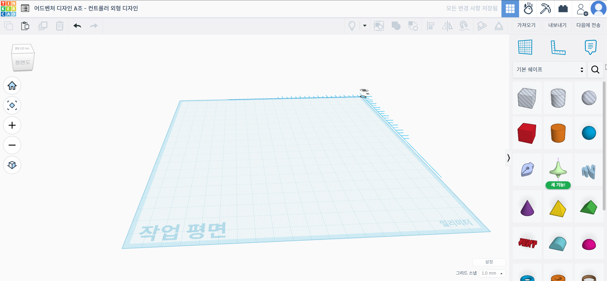
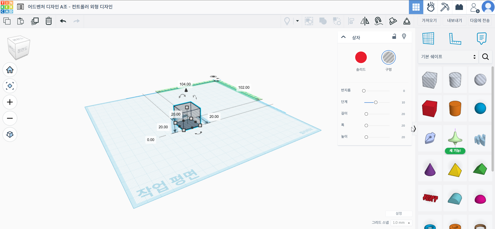
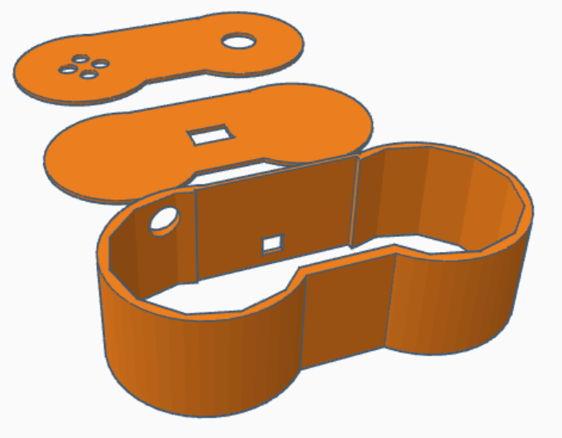

# Thinkercad를 활용한 모델링

훌륭한 하드웨어는 견고하고 사용하기 편한 외형에서 결정됩니다.
아무리 기능이 뛰어난 컨트롤러라도, 전선이 밖으로 노출되어 있거나 손에 쥐기 불편하다면 제대로 된 게임 경험을 제공할 수 없기 때문입니다.

물론 혼자 사용하는데 불편함이 없다면 우드락을 이용하여 부품을 고정하는 것은 간단하고도 좋은 선택입니다.

그러나 컨트롤러 외형 제작에 그 무엇보다도 좋은 도구는 3D 모델링과 3D 프린터를 이용한 출력입니다. 

따라서 이번 프로젝트에서 **Autodesk Tinkercad**를 사용하여 아두이노와 각종 센서를 안전하게 보호하는 컨트롤러 외형을 설계했습니다.

## 왜 Tinkercad인가?

수많은 3D 모델링 툴 중에서 **Tinkercad**를 선정한 이유는 다음과 같습니다.

1. **뛰어난 접근성 (Web-Based):** 별도의 무거운 프로그램을 설치할 필요 없이, 웹 브라우저(Chrome, Edge 등)만 있으면 어디서든 모델링을 시작할 수 있습니다.
2. **직관적인 인터페이스:** 복잡한 CAD 명령어 대신, 도형을 블록 쌓듯이 더하고(Group) 빼는(Hole) 방식만으로 모델링이 가능하여 초보자도 쉽게 배울 수 있습니다.
3. **3D 프린팅 최적화:** 작업한 결과물을 **.STL 파일**로 즉시 내보낼 수 있어, 3D 프린터 슬라이싱 프로그램(Cura 등)과 완벽하게 호환됩니다.

결국, 높은 자유도가 보장된다는 것이 가장 좋은 장점입니다.

---

이제 실제로 Tinkercad에 접속하여 나만의 컨트롤러를 만들어 볼 시간입니다. 설치할 필요 없이 웹 브라우저만 있으면 됩니다!

## Thinkercad 접속 방법

1. **접속:** [Tinkercad 공식 홈페이지 (www.tinkercad.com)](https://www.tinkercad.com)에 접속합니다.
2. **로그인:** 우측 상단의 **[등록 (Sign Up)]** 버튼을 클릭합니다.
   * **개인 계정 생성:** '개인 계정 생성'을 선택하고 이메일로 가입하거나, 구글(Google) 아이디가 있다면 Google로 로그인을 클릭하여 간편하게 시작할 수 있습니다.
3. **대시보드:** 로그인이 완료되면 나의 대시보드가 나타납니다. 여기서 파란색 **[+ 새로 만들기]** 버튼을 누르고 [3D 디자인]을 선택하면 작업 공간으로 이동합니다.

## **Thinkercad 사용법**

### **작업 화면 익히기**

작업 공간에 들어오면 파란색 모눈종이 같은 바닥이 보입니다. 이것이 바로 작업 평면(Workplane)입니다.

컨트롤러를 만들 때 가장 신경쓰야 할 것이 바로 치수인데, 그리드 우측 하단의 그리드 스냅을 설정한다면 가장 작은 모눈의 한 변 길이를 설정할 수 있습니다.
예제에서는 1.0mm를 기준으로 하였습니다.

* **작업 평면 (중앙):** 모델링이 이루어지는 공간입니다.
* **기본 쉐이프 (우측):** 상자, 원통, 구 등 모델링의 재료가 되는 도형들이 모여 있는 패널입니다.
* **시점 조작 (마우스):**
  * **우클릭 드래그:** 화면 회전 (요리조리 돌려보기)
  * **휠 스크롤:** 확대/축소
  * **휠 클릭 드래그:** 화면 이동 (시점 옮기기)

### **컨트롤러 외형 만들기**

Tinkercad 모델링의 핵심은 더하기(Group)와 빼기(Hole)입니다. 찰흙 덩어리를 합치거나 도구를 이용해 파내는 것과 같습니다.

**1. 몸체 만들기 (Body)**

* 오른쪽 패널에서 상자(Box)를 끌어와 작업 평면에 놓습니다.
* 모서리의 하얀 점을 잡아당겨 컨트롤러 크기(약 140mm x 60mm x 30mm 등)에 맞게 늘립니다.
* 도형 속성 창에서 **[반지름(Radius)]** 값을 올리면 모서리가 둥글둥글해져서 손에 쥐기 편해집니다.

**2. 내부 공간 파내기 (Shell)**
컨트롤러 안에는 아두이노와 배터리가 들어가야 하므로 속을 비워야 합니다.

* 방금 만든 몸체를 선택하고 복제(Ctrl+D)를 누릅니다.
* 복제된 도형의 크기를 원본보다 조금 작게(두께 2~3mm 남기고) 줄입니다.
* 복제된 도형의 속성을 솔리드(Solid)에서 구멍(Hole, 빗금 무늬)으로 바꿉니다.
* 이제 원본 몸체와 '구멍' 도형을 동시에 선택하고, 우측 상단의 **[그룹화(Group, Ctrl+G)]** 버튼을 누릅니다.
* **짜잔!** 속이 텅 빈 케이스가 완성되었습니다.

**3. 버튼 구멍 뚫기 (Cutout)**
조이스틱과 버튼이 나올 구멍을 뚫어봅시다.

* 원통(Cylinder)을 가져와서 **[구멍(Hole)]** 속성으로 바꿉니다.
* 원하는 버튼 크기(지름)에 맞춰 조절하고, 버튼이 위치할 곳에 배치합니다.
* 몸체와 '원통 구멍'들을 모두 선택하고 다시 그룹화(Ctrl+G)를 하면 구멍이 뻥 뚫립니다.

### **파일 내보내기** 

모델링이 끝났으면 3D 프린터가 읽을 수 있는 파일로 저장해야 합니다.

1. 우측 상단의 **[내보내기(Export)]** 버튼을 클릭합니다.
2. '다음을 포함...' 항목에서 디자인의 모든 것을 선택합니다.
3. 파일 형식을 [.STL]로 선택하여 다운로드합니다.
4. 이제 이 파일을 'Cura' 같은 슬라이싱 프로그램에 넣고 3D 프린터로 출력하면 됩니다!

### 프로젝트에서 사용한 예제

사실 더 설명할 필요가 있나요? 결국 원통, 직육면체를 자유자재로 늘였다, 줄였다하며 원하는 모양대로 만드는 것이 전부입니다. 

해당 모델의 경우 아주 얇은 원통과 직육면체를 서로 붙여 컨트롤러의 천장과 바닥으로 만들고, 부품이 들어갈 부분에 구멍을 뚫었습니다.

또한 외벽의 경우 속이 빈 원통과 속이 빈 직육면체에 큰 구멍 오브젝트를 결합한 형태로 만들었습니다. 

해당 과정을 통해 뽑은 외관은 서로 테이프로 마감하고, 안에 있는 부품 또한 스카치 테이프와 우드락을 쌓아가며 고정하였습니다.

즉, 여러분의 자유입니다. 어떻게 만들든 상관없고, 저희 프로젝트가 만든 외관은 **전혀 정답이 아닙니다.**

---

**💡 팁:**

* 실수를 했다면 언제든 [Ctrl+Z]를 눌러 되돌릴 수 있습니다.
* 부품끼리 딱 맞게 정렬하고 싶다면 **[정렬(Align, 단축키 L)]** 기능을 사용해 보세요.
